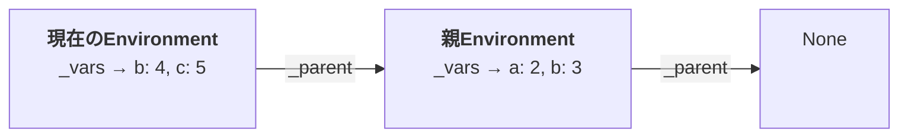
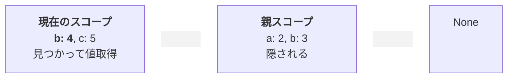

このファイルは、書籍化時のネタとなることを一時的にメモしておくためのものです。
誤りや、興味深い項目の抜けがあれば修正・追加します。
文法や体裁については気にしていません。

# 100行のPythonから育てて原理を学ぶ プログラミング言語の作り方

タイトル候補：
日本語: 100行のPythonから育てて学ぶプログラミング言語の作り方
英語: Learning by Growing: A Programming Language from 100 Lines of Python
Slug: learning-by-growing-language

[350行くらいのPythonで作るプログラミング言語実装超入門](https://zenn.dev/kb84tkhr/books/mini-interpreter-in-350-lines)に続き、PythonとかRubyとかプログラミング言語って中はどうなってるの？なんか面白そうだけど難しいんじゃ？と思っている方へと思って書いた本第2弾です [^2ed]。

[^2ed]:「350行くらいのPythonで作るプログラミング言語実装超入門（第2版）」くらいのつもりで考えてたんですがもう全然別物になってしまったのでタイトルも変えてしまいました。

最初は100行程度のコードでインタプリタのコア部分を作り、アルゴリズムを実行できるようにします。
ここだけ読んでも大きな学びになります。
その後で少しずつ機能を足していき最終的には1,500行くらいになりますが、一度に追加するのはせいぜい数十行なのであまり長さを感じることはないと思います。
どの章で読み終わっても達成感や学びがあるように書いていますので気軽に読み始めてみてください。

## 第1章 はじめに

本書はToil [^toil]というプログラミング言語を作りながら、プログラミング言語処理系の原理を学ぶための本です。
ソースコードを読んで実行するプログラムのことをプログラミング言語処理系と呼ぶのですが、ちょっと長いので本書では処理系と呼ぶことにします。

[^toil]: 趣味で作るおもちゃのような言語をトイ言語と呼びます。Toilという名前は TOI Langugage から来ています。

プログラミング言語ってどうやって動いてるんだろう？と興味を持っている人に向けて書きました。

Pythonをすこし覚えて、リスト（`[2, 3, 4, ...]`）や辞書（`{"a": 2, "b": 3, ...}`）を使ったり
自分でクラスを作ったことがある、くらいの人が読んでいるところを思い浮かべて書いています。
難しいかなと思ったところは簡単に説明しながら進めますし、もともとそれほどややこしい機能は使いませんので安心して読み進めていただけると思います。
知ってる方は適宜読み飛ばしていただければ。

### 本書の特徴

あまり理論的なところには踏み込まず、書いて動かすことを繰り返すことで学習していきます。

ただし、その後の学習につながるよう、用語は一般的な用語を使っていきます。
初めて出てくる用語はかんたんに説明するようにします。
すこし難しく聞こえる言葉もあるかもしれませんが、いったんスルーして先へ進んでみてください。
書いて動かしてを繰り返しているうちにそういうことだったか、とわかるようになると思います。

本書は7部構成になっていますが、第1部ではこのようなプログラムが動かせるインタプリタを
ツリーウォークインタプリタと中間コードインタプリタというふたつの方式で作ります。
「インタプリタ」というのは、すごくざっくり言うとソースコードを読んですぐ実行する処理系のことです。
対となる言葉は「コンパイラ」で、こちらはいったんソースコードを他の形式に変換しておき、
実行時にはその変換したものを使う処理系を指します。
このあたりは細かいことに踏み込むと長くなってしまうのでここまで。

第1章がおわるともうこんなプログラム（？）が動かせるようになります。
読めるでしょうか。
階乗（1からある数まですべてかけ算したもの）を求める関数を定義しています。

```
    ("define", ["factorial_iter", ("func", [["n"], ("seq", [
        ("define", ["result", 1]),
        ("while", [("greater", ["n", 0]), ("seq", [
            ("assign", ["result", ("mul", ["result", "n"])]),
            ("assign", ["n", ("sub", ["n", 1])]),
        ])]),
        "result"
    ])])])
```

第2章を終わると同じプログラムをこういう風に書けるようになります。
これなら「ちょっと違う言語なんだな」くらいの感じで読めるのではないでしょうか。
第1章のプログラムと見比べてみると、ああそういうことか、とわかるかもしれません。
（今はわからなくてもかまいません）

```
    def factorial_iter(n) do
        result := 1;
        while n > 0 do
            result = result * n;
            n = n - 1
        end;
        result
    end
```

第3章では第1章とは異なるやりかたでプログラムを動かします。
ソースコードを中間コードに翻訳するコンパイラと、その中間コードを実行する仮想マシンを組み合わせてプログラムを動かす、というものです。
この本はインタプリタに関する本ですが、中間コードへとは言えコンパイルするのでコンパイラの処理の片鱗を見ることもできます。

このようにつねに処理系を動かしつつ機能を付け加えていき、最後まで進むとわりとモダンな機能を持った言語になります。

* None、bool、整数、配列、辞書のデータ型
* if、while、forなどの制御構造
* 組み込み関数・ユーザ定義関数
* 分割代入・パターンマッチ
* 例外処理
* パイプライン・オブジェクト指向（風）記法
* マクロ・カスタム文法

そして、ToilでToilが書けるようになります。
Toilで書いたToilでToilを動かすこともできます。
何を言ってるかわからねーと思うが（以下略
ツリーウォークインタプリタでも中間コードインタプリタでも同じように動きます。

### 全体の構成と読み進め方

本書はインクリメンタルに開発を進めていくということもあって、順番に読むことを想定しています。
ある程度わかっているから興味のあるところだけ読む、という読み方ももちろんしていただいてかまいませんが、用語やPythonの機能については初出時に説明するようにしていたり、コードを差分形式で書いたりしているため、若干読みづらくなる可能性があります。

全体の構成は以下のようになっています。

* 第1章 はじめに
* 第1部 最小のインタプリタ
  ツリーウォークインタプリタ・中間コードインタプリタというふたつの方式で小さなインタプリタを作ります。
  小さいといってもインタプリタのエッセンスが詰まった章で、とても大きな学びになるはずです。
  * 第2章 最小の評価器 (100行)
    ツリーウォーク型と呼ばれる方式でインタプリタのコア部分を作り、アルゴリズムを実行できるようにします。
  * 第3章：最小の字句解析・構文解析器 (300行)
    ソースコードを読んで、第2章の評価器で読めるようにします。
    これでもう小さなインタプリタになっています。
  * 第4章：最小の中間コードインタプリタ [^bytecode-interpreter]  (500行)
    ソースコードを中間コードに翻訳するコンパイラと、その中間コードを実行するVMの組み合わせでインタプリタのコア部分を作ります。
* 第2部 ツリーウォークインタプリタの拡張（以下未稿）
  ツリーウォークインタプリタに機能を追加していきます。機能だけはわりと最近のスクリプト言語に近いレベルに。
  * 第5章 基本のインタプリタ
    配列型・文字列型・タプル型を導入し、制御構造を強化します。ここまでくらいで自作プログラミング入門としては十分な機能と言えます。
  * 第6章 辞書
    辞書型を導入します。ドット記法を使ってパイプライン的記述・メソッド的記述ができるようにします。
  * 第7章 パターンマッチ
    関数の引数から始めて分割代入・match文・アロー関数などパターンマッチを使った各種機能を導入します。
* 第3部 メタサーキュラー
  ToilでToil自身を扱う方法を学びます。
  * 第8章 メタサーキュラー構造
    eval()やapply()を導入したり、Toil言語でToil処理系を書いたりします。
* 第4部 拡張可能な言語
  ToilでToilを拡張できるようにします。
  * 第9章 ファーストクラスマクロ
    ASTを変換する機能であるマクロを導入し、処理系自体に手を入れなくてもToilの機能を拡張できるようにします。
    マクロの原理を学ぶため、まずは簡易な方式(評価中にマクロを展開する)で実装します。
  * 第10章 カスタム文法
    マクロの呼び出しを、ifやwhileといった構文と同じようなスタイルで書けるようにする文法カスタマイズ機能を導入します。
  * 第11章 事前展開型マクロ
    あらかじめASTを展開してから評価器に渡す、より本格的なマクロを実装します。
* 第5部 中間コードインタプリタの拡張
  第2部・第3部で行った機能拡張を、今度は中間コードインタプリタで行います。
* 第6部 ツリーウォークと中間コードインタプリタの協調動作
  ツリーウォークインタプリタの関数から中間コードインタプリタの関数を読んだり、その逆をできるようにします。
  ツリーウォークインタプリタを実行中に関数をコンパイルできるようにします。
  最後はJITモドキを作って完成となります。
* 第7部 まとめ
* 付録
  本編で実装しなかった機能を追加します。

[^bytecode-interpreter]: おそらく「バイトコードインタプリタ」という言葉の方がなじみがあると思います。本書では中間コードを「バイト」にしないので「中間コードインタプリタ」と呼んでいます。

おすすめの読み方は、一度ざっと読んだら自分で書いてみることです。
読むだけでもそれなりの理解はできますが、自分で書いてみることにより飛躍的に理解度が上がります。
まったく見ないで書く必要はなく、「あれ、ここどうなってたっけな？」と思ったらすぐに書籍を見てかまいません。
まず自分で書いてみるというところが大切で、わかったつもりのところが実はわかってなかった、というところがたくさん見つかるでしょう。
それからもう一度書籍のコードを見ることで理解が進みます。

いきなり自分で書くのが難しい場合はいわゆる「写経」をしてみてもよいでしょう。

この書籍では、第1部を読むとインタプリタ処理系の全体像がつかめるようになっています。
ざーっと第1部の最後まで眺めたら、第2章を読んで書いてみる、3章を読んで書いてみる、のように小刻みに進めてみて


さらに区切って第2章で「評価器」を作るところだけで


### なぜPythonなのか

広く普及していてPythonなら読み書きできるという人が多いというのは大きな理由の一つですが、それだけではありません。

インタプリタを作りましょうという本はたいていC言語やJavaなど、高速な部類の言語を使っています。
インタプリタの性能はそれを書いた言語の速度に直接影響を受けてしまうためです。

残念ながらPythonの実行速度はかなり遅い方で、本来はインタプリタを書くのには適していません。
にもかかわらず本書でPythonを使うのは、「原理を学ぶ」にはPythonが最適だと考えているからです。

Pythonはアルゴリズムを自然に見やすく書けるだけの機能が十分にそなわっており、かつ型などを書かなくてもよいため、プログラムに表現したいことだけに集中できます。
アルゴリズムを教えるとき、読みやすさを重視して「疑似コード」と呼ばれる架空の言語で説明するときがあります。
Pythonのプログラムは、ほとんどこの「疑似コード」に近い読みやすさで、かつ実際に動かすことができるため、原理を学ぶには最適の言語と言えます。

### 本書でやらないこと

本書はコンパクトなプログラムで原理を示すことを狙っているので、それ以外のことはいさぎよく切り捨てています。
これらについては別の書籍で学ぶなり自力でがんばってみるなりしてください。

* エラー処理
  Toilでは、エラーを見つけたら即停止で、行番号も教えてくれません。
  実用的な処理系では、1回の実行（コンパイラなら1回のコンパイル）でできるだけ多くのエラーを見つけ、できるだけわかりやすく表示することが大切です。
* 堅牢性
  たとえば`1 / 0`など実行すればエラーになる式もチェックせずに実行するので、ToilのエラーではなくPythonのエラーで止まります。
  正しい入力に対しては正しく動くという点については注意するけれども、
  不正な入力について適切なエラーになるかどうかは気にしていない、とも言えます。
  Pythonのエラーで止まってしまうかもしれないし、想定外の動きをしてしまうかもしれません。
  実用的な処理系では、自分でチェックして適切にエラー処理を行うことが大切です。
* 性能
  先ほど書いた通り、Pythonで書いているので性能は推して知るべしです。高速な処理系にしたければ高速な言語で。

### 動作環境とソースコードの入手

環境はWindowsでもLinuxでもMacでもかまいませんが、Python 3.12以降が使えるようにしてください。
それより古いバージョンだとエラーが出ます。
Pythonのバージョンを調べるにはコマンドプロンプトやターミナルで`python --version`を実行します。
お使いの環境では`python3 --version`かもしれません。

```
$ python --version
Python 3.12.13
```

3.11.xxより古かったらPythonをバージョンアップしてください。

本書のソースコードは https://github.com/koba925/toil-book/ から入手できます。
章ごとにタグがつけてありますので、任意の章のソースコードを表示できます。

⚠️ 注意事項
リポジトリをcloneしておくと任意の章のソースを手元で実行できて便利ですが、ひとつ注意事項があります。
このリポジトリは、執筆の都合上、ソースに変更があった場合**予告なく履歴の書き換え（Force Push）を行います**。
そのため後日 pull するとコンフリクト（競合）エラーが発生する可能性が高いです。
更新したいときには再度cloneからやりなおすことをお勧めします。
「Download ZIP」であればそのような心配はありませんが、章ごとにダウンロードする必要があります。

では前置きはこれくらいにして、第1部に進みましょう。

## 第1部 最小のインタプリタ

第1部では、ツリーウォークインタプリタ・中間コードインタプリタというふたつの方式で小さなインタプリタを作ります。
小さいといってもインタプリタのエッセンスが詰まった章で、とても大きな学びになるはずです。

* 第2章 最小の評価器 (100行)
  ツリーウォーク型と呼ばれる方式でインタプリタのコア部分を作り、アルゴリズムを実行できるようにします。
* 第3章：最小の字句解析・構文解析器 (300行)
  ソースコードを読んで、第2章の評価器で読めるようにします。
  これでもう小さなインタプリタになっています。
* 第4章：最小の中間コードインタプリタ  (500行)
  ソースコードを中間コードに翻訳するコンパイラと、その中間コードを実行する仮想マシンの組み合わせでインタプリタのコア部分を作ります。

SICPと呼ばれる伝説的名著『Structure and Interpretation of Computer Programs』（邦題：『計算機プログラムの構造と解釈』）のクライマックスは4章・5章なのですが、4章で説明しているのが評価器、5章で説明しているのが中間コードインタプリタです。
つまり第1部を読めばSICPの最も重要な部分が体験できるということです（言い過ぎ）。

## 第2章 最小の評価器

評価器（Evaluator）とは何でしょうか。
「式」を与えるとその式を「評価」して「値」にしてくれるものです。

ざっくり言うと、(2 + 3) * 4 という式を与えればそれを評価、つまり計算して、20ですよと答えてくれる。
そういうものです。

ただし`"(2 + 3) * 4"`という文字列を読んで、2と3を足してから4をかけるんだな、ということをコンピュータに理解してもらうのは意外と手間がかかります。
これは第3章でやります。

評価器にはもっとコンピュータにわかりやすい形で入力してあげます。
Toilでは`("mul" [("add", [2, 3]), 4])`のような形を用います（`"mul"`がかけ算、`"add"`が足し算を意味します）。
これだとコンピュータにもうんとわかりやすい。
見た目にわかりやすくレイアウトされたExcelよりも、CSV形式のファイルの方が集計しやすいようなものです。
私たちはちょっとコンピュータに歩み寄った、こういう形から始めます。

### 定数を評価する

100行から育てると言いました。あれは嘘です。すみません。
本当は6行から始めます。

これが最初の評価器です。
toil.py という名前で保存してください。

```py
class Evaluator:
    def eval(self, expr):
        match expr:
            case None | bool() | int(): return expr
            case _:
                assert False, f"Unexpected expression @ eval(): {expr}"

if __name__ == "__main__":

    toil = Evaluator()

    # Example

    print("Constants:")

    print(toil.eval(None)) # -> None
    print(toil.eval(True)) # -> True
    print(toil.eval(False)) # -> False
    print(toil.eval(2)) # -> 2

    # print(toil.eval([])) # -> Unexpected expression
```

処理系の本体は`Evaluator`クラスで、ここが6行。
あとはそれを動かしてみるためのコードです。

なお、ToilのソースコードはGitHubに置いてあり、章ごとにタグをつけてあります。
この節のコードは以下からアクセスできます。

https://github.com/koba925/toil-book/blob/0101_constants/toil.py

GitHubにはテスト用のコードも入っていますが、この本ではテストコードについては解説しません。
基本的には実行例と同じことを書いています。

なんだかんだ言うのは後にして、動かしてみましょう。

```
$ python toil.py
Constants:
None
True
False
2
```

成功です！
(コマンドの行はOSや設定によって異なります。環境によっては `python3 toil.py` と入力する必要があるかも)

と言われても、ですか？
`print(toil.eval(2))`を実行すると`2`と表示されました。
評価器とは「式」を与えるとその式を「評価」して「値」にしてくれるものです、という言い方にしたがえば
これは`eval()`に`2`という「式」を与えたらそれを「評価」して`2`という「値」が返ってきた、ということです。
なにもしてないじゃないか、と思うかもしれませんが Python も同じことをしますよ？

```
$ python
>>> 2
2
>>>
```

まずは Python のこの機能だけを実装したんだ、と思ってください。
次節ではもっとプログラムっぽいものが書けるようになりますのでお楽しみに。

次に、以下の行のコメントアウトを外して、もう一度実行してみてください。

```py
    # print(toil.eval([])) # -> Unexpected expression
```
↓
```py
    print(toil.eval([])) # -> Unexpected expression
```

こうなります。

```
$ python toil.py
Constants:
None
True
False
2
Traceback (most recent call last):
  File "C:\Users\takahiro\Downloads\0101_constants\toil.py", line 22, in <module>
    print(toil.eval([])) # -> Unexpected expression
          ~~~~~~~~~^^^^
  File "C:\Users\takahiro\Downloads\0101_constants\toil.py", line 6, in eval
    assert False, f"Unexpected expression @ eval(): {expr}"
           ^^^^^
AssertionError: Unexpected expression @ eval(): []
```

Toilでは、エラーを見つけたらいさぎよくその場で `AssertionError` を出して終了します。
ちゃんとした処理系では、エラーの出力は使い勝手に大きくかかわる重要な機能で、
わかりやすいメッセージを出したり、ひとつのエラーで止まらないでできるだけ多くの
エラーを見つけられるようにしたりするために工夫しますが、Toilでは単純に済ませます。

後の節でもエラーになる実行例はコメントアウトして示しますので、コメントアウトを外して試してみてください。

ではコードの解説です。
最初ですのでくわしく説明します。
コードを見てふんふん、と納得できた方は次の節まで飛ばしてしまってかまいません。

```py
class Evaluator:
    def eval(self, expr):
```

`Evaluator`クラスと`eval`メソッドを作っています。
`expr`という名前は expression (式) という単語から来ています。
evalは「式」を受け取る関数ですので。

そして続く`match`文で「式」を計算して「値」にします。
`match`にはなじみのない人がいるかもしれないのですこしだけ説明。

```py
        match expr:
```

`match`文の始まりです。
`expr`が、これから続く`case`にマッチしたらそれを実行してください、と言っています。

```py
            case None | bool() | int(): return expr
```

`expr`が`None`か`bool`型の値か`int`型の値だったら`return expr`を実行します。
`expr`が`None`でも`bool`型でも`int`型でもなかったらこの`case`はスルーします。

どんなものにマッチさせたいかによって`case`はさまざまな書き方ができます。
新しい書き方が出てきたら都度説明します。

```py
            case _:
                assert False, f"Unexpected expression @ eval(): {expr}"
```

`case _:` はどんな式にもマッチしますので
`assert False, f"Unexpected expression @ eval(): {expr}`が実行されて、
`AssertionError`で停止します。
本来は独自の例外（Exception）を定義して使うところですが、本書ではコードを極力シンプルにするためにエラーチェックはすべて `assert` で行います。

`assert <式>, <メッセージ>`は<式>が真であることを確認し、もし真でなければ<メッセージ>を出してプログラムを終了するというものです [^assert-spec]。
ここでは<式>が`False`ですので、かならず終了します。
`toil.eval([])`の実行例では、`[]`が`None`でも`bool`型でも`int`型でもないので`AssertionError`で終了しました。

[^assert-spec]: ものすごく大雑把な説明なので、正しくは https://docs.python.org/ja/3/reference/simple_stmts.html#the-assert-statement を参照してください。

```py
if __name__ == "__main__":
```

`python toil.py`のようにこのファイルを直接実行したときにだけ以下を実行する、という意味です [^main]。
ほかのファイルから`import toil`のようにインポートされたときは実行しません。

[^main]: 詳しく知りたい方は https://docs.python.org/ja/3/library/__main__.html#module-__main__ をご覧ください。

```py
    toil = Evaluator()
```

`Evaluator`オブジェクトを作って使えるようにします。

```py
    # Example

    print("Constants:")

    print(toil.eval(None)) # -> None
    print(toil.eval(True)) # -> True
    print(toil.eval(False)) # -> False
    print(toil.eval(2)) # -> 2

    # print(toil.eval([])) # -> Unexpected expression
```

`eval()`を呼び出して実行します。
`# ->`のコメントの後に実行結果を付記しています。

いかがだったでしょうか？
これでもプログラミング言語かと思うでしょうが、これでもとてもとても小さい言語なのです。
この節だけではちょっとつまらなかったかもしれませんね。
次の節ではプログラムっぽさが出てきます。お楽しみに！

### コラム：式と文

Toilでは、すべてが「式」です。
何かを評価すれば必ず値を持ちますし、関数ではreturnと書かなくても最後に評価した式の値が返されます。

ということは他のプログラミング言語には「式」じゃないものもあるということですね。
それは「文」です。
「式」と「文」の違いは何かっていうとざっくりこんなところです。
（副作用が・・・といった話もあるけれどもここでは触れない）

* 「式」は値を持つ。「文」は値を持たない。
* （文のある言語では）「式」は「文」のパーツになっている。

Pythonで言えば、以下のifは「文」です。

```py
if a == b:
    print(1)
else:
    print(2)
```

`a == b`や`print(1)`、`print(2)`が式で、これらは文のパーツになっていて値を持ちます。
`a == b`はもちろん`True`や`False`の値を持ちますし、
通常はあまり意識しませんが`print()`関数は`None`という値を持ちます。

```py
>>> x = print(1)
1
>>> print(x)
None
```
（式が`None`を返したときはPythonのREPLは値を表示しません）

それに対し、`if a == b: print(1) else: print(2)`全体は値を持ちません。

一方、`1 if a == b else 2`と書くとこれは式で、`1`や`2`という値を持ちます。

### 簡易版の関数を実装する

次は`+`・`==`・`print`に相当する関数を作ります。
ただし、ここでは簡易版の関数を作り、あとでちゃんとした実装に作り直します。

作り直すのになぜ今作るのかというと・・・その方がわかりやすい実行例になるからです。
あと、いったん簡単な実装を見ておいた方がちゃんとした実装を見たときにわかりやすいだろう、という狙いもあります。

Toilでは「式」をタプルで表すことにします。
タプル？なにそれ？という方は、とりあえず配列のようにいくつかの値をまとめたものだと理解してください [^tuple]。

[^tuple]: 詳しく知りたい方は https://docs.python.org/ja/3/tutorial/datastructures.html#tuples-and-sequences をどうぞ。

本格的に言語処理系を実装する場合は、クラスで表すことが多いのですが、
Toilではシンプルに書けてコンパクトに表示できるタプルを使います。
コードを書くにも、デバッグなどでprintなどするにも、タプルの方が短くて済むので学習には便利です。

ここで作る簡易版の関数は`(<関数名>, [<式>, <式>, <式>, ...])`という形をとります。
これからさまざまな「式」が出てきますが、タプルで表される式はすべてひとつめの要素でそのタプルが何であるかを表し、
ふたつめの要素は処理対象を配列にまとめたものを置く、という構造にします。

たとえば`2 + 3`・`2 == 2`・`print(2)`といった式は以下のように表しています。

```py
("add", [2, 3])
("equal", [2, 2])
("print", [2])
```

`[]`の中身は`2`や`3`のような単純な「式」ではなく、関数であってもかまいません。
このようなものも認められます。

```py
("add", [("add", [2, 3]), 4])
("print", [("equal", [("add", [2, 3]), 5])])
```

なお、`[2, 3]`のようなものをPythonでは「リスト」と呼びますが
筆者は宗教上の問題から配列をリストと呼ぶことにはどうしても抵抗があるので本書では配列と呼んでいきます。すみません。
でもソースコード内では`list`と書かざるを得ないときもある。

今回は先に実行例を見てみましょう。
差分の`+`や`-`はつけていません。
GitHubにおいてあるソースでは前回の実行例を丸ごと置き換えていますが、自分で入力している方は
末尾に追加していってもかまいません。

```py
    # Example

    print("Pseudo Functions:")

    print(toil.eval(("add", [2, 3]))) # -> 5
    print(toil.eval(("equal", [2, 2]))) # -> True
    print(toil.eval(("equal", [2, 3]))) # -> False
    print(toil.eval(("print", [2]))) # -> 2\nNone

    toil.eval(("print", [("equal", [("add", [2, 3]), 5])])) # -> True
```

2と3を足して5、2と2が等しいからTrue・・・となります。
最後の行はちょっとややこしいですね。
内側から見ていって、まず2と3を足し、それが5と等しいかどうかを表示しています。
普通のプログラム風に書くと`print(2 + 3 == 5)`を実行していることになります。
`eval()`が自分で`print`しているので、Python側の`print`がないことにも注意してください。

どうですか？
急に複雑なことができるようになって、プログラムが動いている感じがしてきませんか？

`print(toil.eval(("print", [2])))` の `# -> 2\nNone` というコメントは、
まず`toil.eval(("print", [2]))`によって`2`が`print`され、
その後`toil.eval(("print", [2]))`の値の`None`が表示されることを意味しています。
`\n`はそこで行が変わるという意味です。
実際の表示は以下のようになります。

```
$ python toil.py
Pseudo Functions:
5
True
False
2
None
True
```

コードを示します。
この先、本書では前章からの変更箇所を取り出して解説します。
`+`で始まる行が追加された行を示します。
（行頭の`+`や`-`はその行に変更があったということを示すマークなので、ソースコードには入力しないでください）

```diff py
         match expr:
             case None | bool() | int(): return expr
+            case ("add", [a, b]): return self.eval(a) + self.eval(b)
+            case ("equal", [a, b]): return self.eval(a) == self.eval(b)
+            case ("print", [a]): return print(self.eval(a))
             case _:
                 assert False, f"Unexpected expression @ eval(): {expr}"
```

ここには出てきませんが、`-`で始まる行は前章のコードから削除された行を示します。
`-`と`+`が続けて出てきたら、`-`だった行が`+`の行に変更されたことを示します。

```diff py
-    print("Constants:")
+    print("Pseudo Functions:")
```

この場合は`print("Constants:")`の行が`print("Pseudo Functions:")`に変更されたということです。

追加した3行はどれも同じパターンなので1行だけ詳しく見てみましょう。
大事なところがふたつあります。

```py
            case ("add", [a, b]): return self.eval(a) + self.eval(b)
```

ひとつめは`case`の部分。
`match expr:`の中ですので`case ("add", [a, b]):`は`expr`が`("add", [a, b])`という形をしていればマッチします。
`a`や`b`のところは何でもよいので、以下のように、さまざまな形にマッチし、さらに、`a`や`b`にはそれらに対応する部分が入ります。
これが`match`の便利なところです。

```py
("add", [2, 3])                 # a = 2、b = 3 になる
("add", ["foo", "bar"])         # a = "foo"、b = "bar" になる
("add", [True, None])           # a = True、b = None になる
("add", [("add", [2, 3]), 4])   # a = ("add", [2, 3])、b = 4 になる
```

実は`("add", [2, 3])`のようなタプルだけでなく、`["add", [2, 3]]`のような配列でもマッチしてしまうのですが、大目にみてください。
先へ進むと、配列は配列で処理されるようになるので問題はありません。
詳しくは「コラム：タプルと配列」で。

次は`return self.eval(a) + self.eval(b)`の部分。
`("add", [a, b])`という形で`a + b`を表すことにしたので、
`a`と`b`を足して`return`する、というのはいいとして
`eval(a)`や`eval(b)`は何をしているのでしょうか？

`eval(expr)`は`expr`という「式」を「評価」して「値」を返すものでした。
`eval(a)`や`eval(b)`は`a`や`b`が表す「式」を評価して「値」を返します。
「式」である`("add", [2, 3])`に含まれている`2`や`3`もまだ「式」です。
「式」と「式」は足せないので、まず`eval()`して「値」にしてから足しているわけです。
`2`のような「式」を「評価」して`2`という「値」にするのは前章でやりましたね。

また、いったん`eval()`してから足すことにより、`a`や`b`が`2`や`3`といった単純な「式」ではなく、
`("add", [2, 3])`のように別の「式」であっても計算できるわけです。
`("add", [("add", [2, 3]), 4])`であれば、まず内側の`("add", [2, 3])`と`4`を「評価」して、
`5`と`4`という「値」にしてから足しています。
`eval()`が「式」を「値」に変換している、という点がとても重要ですので、いつも意識していてください。

`eval()`してから足すようにするだけで、「まず内側の・・・」といった処理がごく自然に処理でき、
複雑に入れ子になった「式」が評価できてしまうというのは驚きでした。
これが「再帰呼び出し」の効果です。

`eval()`の中から自分自身、つまり`eval()`を呼ぶことを再帰呼び出しと言います。
自分自身を呼ぶ？とちょっと難しいように感じてしまうかもしれませんが、
実際には「式」を評価するために`eval()`を呼ぶというごく自然なやり方にすぎません。

「式」の中に「式」が含まれるように、自分自身と同じものを含む構造のことは再帰的構造と呼びます。
再帰的構造を持つものを処理するには再帰呼び出しを使うのが自然であることが多いです。
ぜひマスターしてください。
本書の中でも一番大事なところかもしれません。

`"add"`で説明してきましたが、`"equal"`や`"print"`の「式」もまったく同じように処理できます。
`toil.eval(("print", [("equal", [("add", [2, 3]), 5])]))`のように混在しても大丈夫。

ところで、おそらく`self.eval(a) + self.eval(b)`のところで警告が出てると思います。
`self.eval(a)`の結果と`self.eval(b)`の結果が足し算できるとは限らないためです。
足し算できない場合はエラーになりますが、こういうのはToilでは気にしないことにします。
Pythonが足せれば足すし、エラーになるならそういうものとしてあきらめる、ということです。
ちゃんとした言語を作るときは、足し算できるかどうか確認し、できなければエラーにしてください。
約束ですよ？

警告は、関数をちゃんと実装したときには出なくなります。
やっぱり足せないものを足そうとすればエラーにはなるんですが。

ソース：https://github.com/koba925/toil-book/blob/0102_pseudo_func/toil.py
差分：https://github.com/koba925/toil-book/compare/0101_constants...0102_pseudo_func

### コラム：タプルと配列

タプルと配列（list）を使いました。
どちらもいくつかの値をまとめるために使うものです。
ではなぜ両方使っているのでしょうか？

こんな感じで使い分けています。

* 配列は同類のものを並べたもの。個数は決まっていない。
* タプルは異質のものを並べたもの、個数は決まっている。

`("add", [2, 3])`や`("print", [2])`のような関数の表現でいえば、
まず外側のタプルでは要素はふたつと決まっていて、ひとつめが関数、二つ目が関数の引数（の集まり）という異質のものが並んでいます。
内側にある配列を見ると、引数という同類のものがいくつか並んでいますが、いくつあるかは関数によって異なります。

Pythonでは、配列はミュータブル（値を変更できる）でタプルはイミュータブル（値を変更できない）という違いもあります。
Toilでもたまにその違いが顔を出します。

なお、`case`では配列とタプルが区別されません。びっくりです。

```py
match [2, 3]:
    case (a, b): print("tuple")
    case [a, b]: print("list")
```

とやると`tuple`と表示されてしまいます。
これは`case (a, b):`や`case [a, b]:`はシーケンスパターンと言い、
タプルも配列もどちらも「シーケンス」としていっしょくたにされてしまうからです。

タプルにマッチさせたいときは、`case ("seq", exprs) if isinstance(expr, tuple): ...`などと明示的にチェックするのがよい書き方です。
Toilでは、のちほど「もし配列だったら」というcaseが追加されるので、
それ以降はすべてタプルと判断できるようになるためひとつひとつ確認はしていません。
厳密には dequeやnamedtupleもマッチしてしまうのでダメなんですが
Toilではタプルか配列しか扱わないのでいいことにしてます。

タプルについて忘れてはいけないことがもうひとつ。

タプルはよく`(2, 3)`のようにカッコで囲んで書かれますし、表示するとカッコがついて表示されるので
カッコがタプルを表す記号のように思うかもしれませんが、タプルの本体はカンマです。
カッコは書かなくてもタプルです。

```
>>> (2, 3)
(2, 3)
>>> 2, 3
(2, 3)
```

逆に、カンマがなければタプルになりません。カッコをつけてもだめです。
そのため、要素が一つのタプルを作りたいときでもカンマは必要です。
ちょっと見ばえがよくないですが。

```
>>> (2)
2
>>> (2,)
(2,)
>>> 2,
(2,)
```

Pythonには`a, b = b, a`と書くと`a`と`b`を入れ替えられるよ！という技がありますが
`(a, b) = (b, a)` と同じ意味なんですね。

Toilのソースコードでは、たいていカッコをつけた書き方にしていますが、
カッコがないほうが見やすいと思ったらつけていないときもあります。

とてもおもしろい仕様なんですがじゃあ `print(2, 3, 4)` の `2, 3, 4` は
タプルなのかというとそうではありません。
これもちょっと気持ち悪いところ。

### 複数の式を評価する

今度は、もっとも基本的な制御構造である順次実行（Sequence）を作ってみます。
制御構造と言ってもややこしいものではなく、複数の式を順番に評価していくだけのものです。

制御構造というとifとかwhileとかは聞いたことあるけど順次実行ってなんだっけ？と
思う人もいるかもしれませんが超身近なやつです。

こういうのです。

```py
print(2)
print(3)
print(4)
```

2をprintして、その次に3をprintする、その次に4をprintする、の「その次に」が順次実行です。
なあんだ、って感じですよね。

順次実行は`("seq", [<式>, <式>, ...])`という形で表すことにします。
コードはこうです。

```diff py
 class Evaluator:
     def eval(self, expr):
         match expr:
             case None | bool() | int(): return expr
+            case ("seq", exprs): return self._seq(exprs)
             case ("add", [a, b]): return self.eval(a) + self.eval(b)
             ...

+    def _seq(self, exprs):
+        val = None
+        for expr in exprs: val = self.eval(expr)
+        return val
```

`case ("seq", exprs):`は少しだけ新しいパターンです。
`case ("add", [a, b]):`と見比べてみてください。
`exprs`には`("seq", [<式>, <式>, ...])`という式の`[<式>, <式>, ...]`という配列がそのまま入ります。

`for expr in exprs: val = self.eval(expr)`では、`exprs`に含まれる`<式>`をひとつひとつ評価して`val`に保存します。
ループを抜けたら`val`を返します。
`val`はループを回るたびに上書きされますので、最後の`<式>`の評価結果が帰ることになります。
これが、「コラム：式と文」で書いた「関数ではreturnと書かなくても最後に評価した式の値が返されます」の正体です。
もし`exprs`に`<式>`が一つも入ってなかったら、最初に設定した`None`が返ります。

`_seq()`の名前がアンダースコアから始まっているのは、「このメソッドはクラスの中からだけ呼び出されるメソッドですよ」という気持ちを表しています。
といってもクラスの外から呼び出してもエラーにはならず、普通に呼び出せてしまいます。
紳士協定のようなものです。よいこはきまりをまもります。
もっと厳しく隠せる書き方もあるのですが、本書で扱うコードの規模であればこれで十分です。

実行例の部分です。

```py
    print("Sequence:")

    print(toil.eval(("seq", []))) # -> None
    print(toil.eval(("seq", [("add", [2, 3])]))) # -> 5
    print(toil.eval(("seq", [("print", [2]), 3]))) # -> 2\n3
    print(toil.eval(("seq", [("print", [2]), ("seq", [("print", [3]), 4])])))
    # -> 2\n3\n4
```

実際に動かすとこうなります。

```
$ python toil.py
Sequence:
None
5
2
3
2
3
4
```

結果とコードを見比べて、以下のようになっているか確認してみてください。

* `<式>`が0個、1個、2個以上で正しく動いていること
* `<式>`が書いてある順番に評価されていること
* `"seq"`を入れ子にしても正しく評価されること

たった数行の追加でプログラミング言語に機能を追加できるってちょっとびっくりではないですか？
いや順番に実行するだけなんだからそんなもんだろうって？
次はifをやりますよ！

ソース：https://github.com/koba925/toil-book/blob/0103_sequence/toil.py
差分：https://github.com/koba925/toil-book/compare/0102_pseudo_func...0103_sequence


### ifを実装する

もうひとつ制御構造を作ってみましょう。
こんどは「選択」(Selection)つまり`if`です。

Pythonで`if`といえばこういうのですが

```py
if a == b:
    return 1
else:
    return 2
```

Toilの`if`は式なので、こっちに近いです。

```
1 if a == b else 2
```

`if`はこんな形にします。
Pythonの`if`では`else`がなかったり`elif`で続いたりしますが`eval()`ではこの形のみ扱います。

`("if", [<条件式>, <帰結式>, <代替式>])`

ここで

* 条件式（Condition）は帰結式と代替式のどちらを評価するか決める式
* 帰結式 (Consequent) は条件式が真の時に評価される式
* 代替式 (Alternative) は条件式が偽のときに評価される式

です。
条件式、帰結式、代替式と呼ぶとなんだか難しそうに聞こえると思いますのでCond式、Then式、Else式と呼んでいきます。

ポイントとなるのはCond式が真の時はElse式は評価されず、Cond式が偽の時はThen式は評価されない、ということです。
`case ("add", [a, b]): return self.eval(a) + self.eval(b)`のように、全部評価してしまってはいけません。
当たり前に思えるかもしれませんが大事なところです。

`a / b`を計算したいけれども`b`が0だとエラーになってしまうのであらかじめチェックしてからにしようと
こう書いたとします。

```py
if b != 0:
    print(a / b)
else:
    print("b must not be 0")
```

`b != 0`が偽、つまり`b == 0`のときに実行してほしいのは`print("b must not be 0")`だけです。
`print(a / b)`が実行されてしまってはあらかじめチェックした意味がありません。
この「当たり前の話」はずーっと後になってまた意味を持ってきます。

ではifを実装しましょう。
今回は新しい書き方は出てきませんのでもう読めるはず。

```diff py
 class Evaluator:
     def eval(self, expr):
         match expr:
             case None | bool() | int(): return expr
             case ("seq", exprs): return self._seq(exprs)
+            case ("if", [cond_expr, then_expr, else_expr]):
+                return self._if(cond_expr, then_expr, else_expr)
             case ("add", [a, b]): return self.eval(a) + self.eval(b)
             ...

     def _seq(self, exprs):
         ...

+    def _if(self, cond_expr, then_expr, else_expr):
+        if self.eval(cond_expr):
+            return self.eval(then_expr)
+        else:
+            return self.eval(else_expr)
```

Cond式（`cond_expr`）を評価して、真ならThen式（`then_expr`）を評価して返し、
真でなければElse式（`else_expr`）を評価して返します。
Cond式が真の時はElse式は評価されず、Cond式が偽の時はThen式は評価されない。
いいですね？

なお、本書では「式」が入る変数には「_expr」をつけ、「値」が入る変数には「_var」をつけます。
Toilでは「式」である`2`と「値」である`2`の見分けがつかないので、せめて変数名で区別をつけようという作戦です。
そうでなくても`cond_expr`を評価した結果をまた変数にとっておきたければ`cond_ナントカ`という名前を考えるくらいしかないので、
命名規約を考えておいた方が頭を使わないで済むというのもあります。
ほかの「式」や「値」がでてこない場所では単に`expr`、`val`という変数にすることもあります。

では実行例です。

```py
    print("If:")

    print(toil.eval(("if", [("equal", [2, 2]), 3, 4])))
    # -> 3

    print(toil.eval(("if", [("equal", [2, 3]), 4, 5])))
    # -> 5

    print(toil.eval(("if", [True, ("seq", [2, 3]), 4])))
    # -> 3

    print(toil.eval(("if", [False, 2, ("if", [True, 3, 4])])))
    # -> 3
```

実際に実行するとどうなるかはもうわかると思いますので書きません。

3番目、4番目の例は、Then式やElse式のところに本当に式が書けるかを試しています。
式を`eval()`するのを忘れてしまうとこういうところでエラーになります。

また4番目の例は`elif`がなくても同じことが書けるよ、という例でもあります。
この式は、`elif`まで書けるようになったToilではこのような式と同じものです。

```
if False then 2 elif True then 3 else 4 end
```

Pythonで書けば

```py
if False:
    return 2
elif True:
    return 3
else:
    return 4
```

というのはこう書いても同じです、ということです。

```py
if False:
    return 2
else:
    if True:
        return 3
    else:
        return 4
```

Toilの式のほうにインデントをつけると対応付けやすいでしょうか。

```py
("if", [False,
    2,
    ("if", [True,
        3,
        4
    ])
])
```

インデントが深くなるので`elif`を使ったほうが読みやすくなりますが、
`elif`がなくても`if`・`then`・`else`だけで同じことが書けます。
なので `("if", [<条件式>, <帰結式>, <代替式>])` だけあればよいのです。
人間にやさしくするのは次の章でやります。

ということでifもやっぱり数行で実装できました！

次は変数を導入します。
`"seq"`や`"if"`とは違って、大手術が必要になります。

### コラム：TruthyとFalsy

簡単に通り過ぎましたが、実は重要なのが「Truthy」「Falsy」という概念です。
前節では「真」「真でない」「偽」と書いてちょっとごまかしています。

```py
    if a:
        print("True")
    else:
        print("False")
```

というプログラムで、`print("True")`が実行されるのは`a`が`True`のときだけではありません。
PythonのREPLで実験してみましょう。

```py
>>> if True:
...     2
... else:
...     3
...
2
>>> if False:
...     2
... else:
...     3
...
3
```

これは当然ですね。
ではこれは？

```
>>> if 1:
...     2
... else:
...     3
...
2
>>> if 0:
...     2
... else:
...     3
...
3
```

どうやら`if 1:`は`if True:`のように、`if 0:`は`if False:`のように働くようです。

もっと直接的に試します。
`bool()`を使うと、なんでも`bool`型の値にできます。

```py
>>> bool(0)
False
>>> bool(1)
True
>>> bool("")
False
>>> bool("hello")
True
>>> bool([])
False
>>> bool([2])
True
>>> bool(None)
False
```

どんな値が`False`になり、どんな値が`True`になっていますか？
Pythonでは、何もない、空っぽとみなせる値は`False`で、それ以外の値はすべて`True`になります。

このように、`True`とみなされる値と`False`とみなされる値があります。
`True`とみなされる値をTruthy、`False`とみなされる値をFalsyと言います。
Trueっぽい、とかFalseっぽい、という感じですね。
PythonはCond式がTruthyならThen式を、FalsyならElse式を実行しているというわけです。

このあたりの考え方は言語によって千差万別で、言語設計者の考え方が現れるところと言えます。
`False`のみが`False`で、その他の値はすべて`True`と扱う言語もあります。
また、Cond式にbool型、つまり`True`か`False`になる式しか認めず、それ以外はエラーにする言語もあります。
この場合はそもそもTruthyとかFalsyという考え方が存在してないということですね。

Toilの`"if"`の処理はごくシンプルに以下のように書いています。

```py
        if self.eval(cond_expr):
            return self.eval(then_expr)
        else:
            return self.eval(else_expr)
```

これは、`self.eval(cond_expr)`を評価してPythonが真だと思ったら
`return self.eval(then_expr)`を実行し、そうでなければ
`return self.eval(else_expr)`を実行するということですので、
Truthy・Falsyの考え方はPythonにおけるそれをそのまま引き継ぐことになります。

本書では処理系をコンパクトに保つためあちこちでこのようにPython任せにしている箇所があります。
たとえば`"add"`はPythonの`+`をそのまま使っていますので、文字列や配列の連結もできます。
（まだToilで文字列や配列を扱えるようにはしていませんが）

いやifは`True`か`False`しか許さないほうが安全だろ、とか
`"add"`ではこういうこともしてくれたらいいんじゃない？などと思ったら
自分の思った通りに実装してください。
好きなようにできるのが自作プログラミング言語の楽しいところですから！

`True`・`False`についてはもうひとつ話したいことがあるんですがちょっと長くなってきたので別コラムで。

ソース：https://github.com/koba925/toil-book/blob/0104_if/toil.py
差分：https://github.com/koba925/toil-book/compare/0103_sequence...0104_if

### 変数の定義と参照

次は変数を導入します。
`("define", <名前>, <式>)`で変数を定義し、参照したいときは単に`<名前>`で参照します。

実行例からいきます。

```py
    print("Variable:")

    print(toil.eval(("define", ["a", ("add", [2, 3])])))
    # -> 5

    print(toil.eval("a"))
    # -> 5

    print(toil.eval(("if", [("equal", ["a", 5]), 2, 3])))
    # -> 2

    print(toil.eval(("define", ["a", 6])))
    # -> 6

    print(toil.eval("a"))
    # -> 6
```

最初の例では、`2 + 3`つまり`5`という値で`a`という変数を定義しています。
`"add"`や`"if"`などと同じように、変数名も単なる文字列で表します。
この`"define"`の式自体が`5`という値を返していることに注意してください。
Toilではすべてが式なのでなにか値を返さないといけないということと、
変数の値自体を返すことで`a = b = 2`のような書き方に自然に対応できるということから
このような仕様にしています。

変数を定義する、というのはPythonを使っているとあまり意識していないかもしれません。
JavaScriptなどの言語であれば`var a`のように、「これからこういう変数を使うよ」と宣言することができます。
JavaScriptでは変数の宣言は必須ではありませんが、Toilでは必須とします。
さらにToilでは必ず同時に値を設定するようにします。
JavaScriptで言えば`let b = 2`のようなものですね。
これが変数の定義ということです。

Pythonでは初めて使う変数でも`a = 2`などとなんの宣言もなく書き始められますが、
これが変数の定義を兼ねています。
便利なのは便利なのですが、副作用（しかも私があまり好きでない）もありまして
Toilでは定義と代入（定義済みの変数に値を設定しなおすこと）を分けています。

2番目、3番目の例は変数の参照の例です。
`"a"`などと名前を書くだけで、評価するとその変数が持つ値になります。
他の式の中で使っても大丈夫。`eval()`してから使うという再帰の効果ですね。

4番目・5番目の例は同じ名前でもう一度変数を定義しようとするとどうなるか、という例です。
ちゃんとした言語では定義（宣言）済みの変数を再度定義しようとするとエラーになるのが普通ですがToilでは気にせず上書きします。
「定義」という言葉とはちょっとずれがありますが実験にはその方が便利なので。
ちょっと値が違ってたから変更しよう、とか。

さて変数を使えるようにするには、`a`は2で`b`は3、などと覚えておく場所がどうしても必要になります。
変数の値を覚えておく場所を環境（Environment）と呼びます。
まずは環境のクラスを作ってしまいましょう。
名前と値を対応させるので、辞書（dict）がぴったりですね！

ソースの一番上に追加してください。

```diff py
+class Environment:
+    def __init__(self):
+        self._vars = {}
+
+    def define(self, name, val):
+        self._vars[name] = val
+        return val
+
+    def val(self, name):
+        return self._vars[name]
+
+
 class Evaluator:
     ...
```

`__init__()`は`env = Environment()`のようにオブジェクトが作られるとき、最初に呼ばれるメソッドです。
ここでは、変数を覚えておく辞書（`_vars`）を作っています。
中身は当然空っぽ。

`_vars`と名前がアンダースコアから始まっているのは`_seq`や`_if`と同じ意味合いで、
これはクラスの中だけで使う変数ですよ、という意図を示しています。
やっぱりクラスの外からでもアクセスしようとすればできてしまいます。
よいこはお行儀よく。

`define()`は名前と値を受け取って、`_vars`の中に変数を定義する関数です。
`self._vars[name] = val`で辞書`_vars`に`name`というキーで値を登録しています。
これで変数が定義されました。
すでにキーが存在する場合はそのキーの値を新しい値に変更します。
変数の再定義を許さない場合はここでチェックすることになります。
`return val`は値をそのまま返します。最初の実行例のところで説明したとおりです。

`val()`は変数名を受け取って、その変数の値を返します。
単純です。

ここからEvaluatorクラスの修正に入ります。
まず、この「環境」を評価中ずっと持ちまわるために`eval()`、`_seq()`、`_if`のすべてに`env`という引数を追加します。
これにより、どこにいても環境にアクセスできるようになります。
編集箇所がちょっと多いので申し訳ないんですが、以下のような修正をお願いします。
`, env`という文字列をコピーしておいて貼り付けていけばそこまで手間ではないかと・・・
`expr)`を`expr, env)`に置換するとかすれば多少手間が減るかも。
言語によってはvscodeやIDEが支援してくれるんですが私の知る限りPythonにはなさそうです。

`self._env`のように Evaluator自身のプロパティとして持たせるやり方でもよくて、
それならメソッドの引数に`env`を追加する必要はなくなるのですが、
引数で持たせたほうがキレイで安全に書けたりするのです。

以下に示す差分のコードはいつもと違って`-`の行は消してあります。
そのほうが見やすいと思いますので。

```diff py
 class Evaluator:
+    def eval(self, expr, env):
         match expr:
             case None | bool() | int(): return expr
+            case ("seq", exprs): return self._seq(exprs, env)
             case ("if", [cond_expr, then_expr, else_expr]):
+                return self._if(cond_expr, then_expr, else_expr, env)
+            case ("add", [a, b]): return self.eval(a, env) + self.eval(b, env)
+            case ("equal", [a, b]): return self.eval(a, env) == self.eval(b, env)
+            case ("print", [a]): return print(self.eval(a, env))
             case _:
                 assert False, f"Unexpected expression @ eval(): {expr}"

+    def _seq(self, exprs, env):
         val = None
+        for expr in exprs: val = self.eval(expr, env)
         return val

+    def _if(self, cond_expr, then_expr, else_expr, env):
+        if self.eval(cond_expr, env):
+            return self.eval(then_expr, env)
         else:
+            return self.eval(else_expr, env)
```

その後以下の3行を追加します。
この節はいろいろ修正・追加していますが、本質的な変更はEnvironmentクラスの追加と
この3行です。

```diff py
             case None | bool() | int(): return expr
+            case str(name): return env.val(name)
+            case ("define", [name, expr]):
+                return env.define(name, self.eval(expr, env))
             case ("seq", exprs): return self._seq(exprs, env)
```

`match expr`～`case str(name): return env.val(name)`では、
`expr`が`str`型だったら`expr`の値を`name`に入れて`return env.val(name)`を実行します。
`val()`は変数名を渡すと変数の値を返してくれるメソッドでした。

`"define"`の方も似たようなものです。
変数名と、`expr`を`eval()`して値にしたものを`define()`に渡して変数を定義してもらいます。

あと少しです。

`eval()`に`env`という引数が増えましたので、誰かがEnvironmentオブジェクトを作って
渡してあげないといけません。
そのためにInterpreterクラスを作ります。
Interpreterクラスのオブジェクトで環境を作り、それを持ち続けて毎回`eval()`に渡してやることで、
定義した変数を次の`eval()`に持ち越すことができます。

Evaluatorクラスの下に定義しましょう。

```diff py
 class Evaluator:
     ...


+class Interpreter:
+    def __init__(self):
+        self._env = Environment()
+
+    def eval(self, expr):
+        return Evaluator().eval(expr, self._env)


 if __name__ == "__main__":

-    toil = Evaluator()
+    toil = Interpreter()

     # Example
     ...
```

今までEvaluatorオブジェクトを作っていたところでInterpreterオブジェクトを作るようにしました。
呼び出し方は今までと変わらず`toil.eval()`で大丈夫です。

すこしややこしかったでしょうか？
あちこち修正したのでややこしく感じるかもしれませんが、個々の修正はそれほどややこしいことをしているわけではありません。
どこを修正しているかわかったところでもう一度節の頭から読み直すと意外とすんなりわかるかもしれません。

次章では変数のスコープを導入します。
ややこしさがちょっと上がりますので、この節の内容はしっかり把握しておきましょう。
ゆっくりで大丈夫です。

ソース：https://github.com/koba925/toil-book/blob/0105_var/toil.py
差分：https://github.com/koba925/toil-book/compare/0104_if...0105_var

### コラム：TrueとFalseの値

> `True`・`False`についてはもうひとつ話したいことがあるんですがちょっと長くなってきたので別コラムで。

続きです。
でも`True`と`False`の値ってそんなの`True`と`False`じゃないの？ほかに何があるの？

といったところで突然ですが、Toilの実行例やテストでいつも`2`とか`3`とか使ってるのなんでだろうって思いませんか？
急に関係ない話を持ち出したようですが関係あるのです。

Pythonで`True + True`を計算してみましょう。
当然エラーですよね。

```py
>>> True + True
2
```

ﾅﾝﾀﾞｯﾃ━━━━━━(； ･`д･´)━━━━━━!!!!!!

なおJavaScriptでも`true + true`は2です。

```js
> true + true
2
```

知ってる人は知ってる話ですがPythonのTrueはintです（ある意味で）。ええええ？

``` py
>>> isinstance(True, int)
True
```

Pythonではboolがintのサブクラスだからなんですが。

```py
>>> issubclass(bool, int)
True
```

結局、PythonではTrueは必要に応じて1になるということでした。

``` py
>>> int(True)
1
```

ちなみにFalseは0です。

```py
>>> 1 * False
0
>>> int(False)
0
```

Toilの実行例やテストで`2`以上の数を使っているのはこのへんに理由があります。
ある式が`True`を返すことをテストしたくて `assert toil.eval(...) == True` と書いてしまったとします。

ところがこのテストでは `toil.eval(...)` が 1 を返しても成功してしまうのです。

```py
>>> 1 == True
True
```

なので。
`== False`とテストしてしまうのも同じリスクがあります。

```py
>>> 0 == False
True
```

実は `== True` とか `== False` という書き方がよくなくて、本当は `is True` とか `is False` と書くべきです。
これなら`1`と`True`を見分けてくれます。

```
>>> True is True
True
>>> 1 is True
<stdin>:1: SyntaxWarning: "is" with 'int' literal. Did you mean "=="?
False
```

とはいえ、`0`とか`1`とかの値はほかにもなにか特別な状態を表す数字として用いられたりもするので、
たまたまテストが成功してしまうことをちょっとでも防ごうということで数は`2`から使うことにしているのでした。

ところで（ところでが多い）
`SyntaxWarning: "is" with 'int' literal. Did you mean "=="?`というメッセージが表示されていますね。
「`is`じゃなくて`==`じゃないですか？」と言ってます。
`1 is True`という式は文法的には完全に合法なのでただ実行してFalseと表示するだけで
処理系の責任は果たしているんですが、わざわざアドバイスのようなものを表示しています。
できるだけ親切なメッセージを表示しようというのが最近のトレンドですね。
こういったメッセージもプログラミング言語処理系のユーザインタフェースの一部ですので。

話をもとに戻して、どうしてこんなことになっているのかというと、
Pythonにはもともと`True`や`False`がなく、代わりに`1`や`0`が使われていて、
`True = 1`とか`False = 0`とか（この`True`や`False`はboolの値ではなくそういう名前の変数です）各自で定義して使っていました。
そのため、後になって`True`と1は別物だよとは言えなかったという事情があります。
詳しくは https://peps.python.org/pep-0285/ をどうぞ。

プログラミング言語が広く使われるようになると、うっかり仕様変更もできなくて大変ですね。
Python3への移行では（長くなりそうなので略
いやー使われないプログラミング言語書いててよかった（負け惜しみ

### スコープと代入

本節ではスコープと代入を導入します。

スコープとは変数をその外から見えないように閉じ込めた、ある範囲のことを言います。
スコープも変数定義と同様Pythonではそれほど意識されていないかもしれません。
というのは、Pythonには明示的にスコープを作る構文がないからです。

といってもPythonにスコープが存在しないわけではなく、関数やメソッドを書くとスコープが作られます。

```py
>>> def foo(a): a += 1; b = 3
...
>>> a = 2; foo(a)
>>> print(a)
2
>>> print(b)
Traceback (most recent call last):
  File "<stdin>", line 1, in <module>
NameError: name 'b' is not defined
```

`foo()`の中の`a`はその外側で作られた`a`とは別物なので、`foo()`の内部で`a`を変更しても
`foo()`の外の`a`には影響を与えませんし、`foo()`の中で作った`b`は`foo()`の外では見えません。
このように、変数の有効な範囲を区切っているのがスコープなのです。

この後の節で関数を実装することになりますが、実はスコープと環境を組み合わせるだけで
関数のしくみができてしまいます [^more-parts]。
そういう意味では言語処理系の基礎をなすしくみのひとつだと言っていいでしょう。

[^more-parts]: 2章の範囲では。4章ではもうひとつ大事なしくみが必要になります。

一方、JavaやJavaScriptなどの言語では {} で囲むとスコープができます [^javascript-scope]。
この構文を使ってもうすこしスコープの持つ性質を説明します。

[^javascript-scope]: JavaScriptではややこしいところもあるんですがとにかくできることはできます

スコープの中にいるときは、外の変数が見えます。
変数に値を代入すると、外の変数の値が変更されます。

```js
let a = 2
{
    print(a) // -> 2
    a = 3
}
print(a) // -> 3
```

スコープの中で変数を定義すると、スコープの中だけで有効な変数ができます。
たとえ名前が同じであっても、その変数への代入はスコープの外の変数には影響しません。
スコープの外からはスコープ内で定義した変数は見えません。

```js
let a = 2
{
    print(a) // -> 2
    let a = 3
    print(a) // -> 3
    a = 4
    print(a) // -> 4
    let b = 5
    print(b)
}
print(a) // -> 2
print(b) // -> エラー
```

この例の`a`のように、内側のスコープで同じ名前の変数を定義して、外側の変数を見えなくすることを
「シャドウイング」（Shadowing: 覆い隠し）と言います。

プログラムが大きくなると、どんな変数をどこで使っているか把握することが難しくなり、
変数を変更したら思わぬところに影響が出た、ということが起こりやすくなります。
スコープを利用して影響する範囲を区切って影響を局所的なものにすることにより、
そのような影響が出ないようにすることができます [^use-function-not-scope]。

[^use-function-not-scope]: と言っても、明示的なスコープを入れないといけないとわかりづらい、
という状態はもうすでに関数が大きすぎます。関数を分けましょう。

これを実現するために、Environmentを親子関係でつなげられるようにします。
そのために、Environmentクラスに`_parent`プロパティを追加します。

```diff py
 class Environment:
-    def __init__(self):
+    def __init__(self, parent=None):
+        self._parent = parent
         self._vars = {}
```

`_parent`には親、つまり外側の環境を覚えさせます。
`new_env = Environment(env)`として新しく環境`new_env`を作ると、`new_env._parent`に`env`が記録されます。
これは、`new_env`が外側の環境を知っているというわけで、変数`a`を`new_env`で探してみたけど見つからなかった、
というときには外側の環境を探しに行けるようになりました。
逆に言うと、`new_env = Environment(env)`は`env`の内側に新しく`new_env`を作っている、とも捉えられます。

`def __init__(self, parent=None):`の`parent=None`は、引数が指定されていないときには`parent`を`None`とする、ということです。
これにより、Interpreterクラスにある`self._env = Environment()`はそのままでもエラーにならず、`self._env`の`_parent`は`None`になります。

Interpreterクラスの`self._env`は最上位（最も外側）の環境で、それより上の環境はないので、
下位の環境から`_parent`をたどりつつ変数を探していき、`_parent`がNoneである環境でも変数が見つからなければ
その変数は定義されていなかった、ということになります。

次は代入（Assign）を見てみましょう。

```diff py
     def define(self, name, val):
         self._vars[name] = val
         return val

+    def assign(self, name, val):
+        if name in self._vars:
+            self._vars[name] = val
+            return val
+        elif self._parent:
+            return self._parent.assign(name, val)
+        else:
+            assert False, f"Undefined variable @ assign(): {name}"
```

変数定義と違うのは、代入ではすでに存在する変数の値を変更するというところです。
変数定義（`define()`）の方は存在するかどうか気にせずそのまま値を設定していますね。

代入ではまず、変数を見つけなければいけません。
`assign()`をぶった切りながら説明していきます。

```py
    def assign(self, name, val):
        if name in self._vars:
            self._vars[name] = val
            return val
```

`name in self._vars`は、`self._vars`のキーに`name`が含まれていればTrueになる式です。
含まれているということは変数が見つかったということですので、`define()`の時と同様に
値を設定し、またその値を返します。

続いて

```py
        elif self._parent:
            return self._parent.assign(name, val)
```

`_vars`に`name`が含まれていなかった場合は`self._parent`が`None`かどうか確認します。
`elif self._parent:`はちょっと省略した書き方で、`elif self._parent != None:`とだいたい同じ意味です [^if-not-none]。
つまり、まだ外側の環境があるということです。
なので、`return self._parent.assign(name, val)`でひとつ外側の環境で`assign()`します。
これもまた自分自身を呼んでいますので再帰の例となっています。
自分自身を呼ぶと言っても、環境をひとつずつ登っていきますので同じところを無限にぐるぐる回ることはなく、
最悪でもいちばん外側までたどったらそこで終わります。

[^if-not-none]: なんでそうなるの？と思った方はちょっと戻って「コラム：TruthyとFalsy」を読んでみてください。

```py
        else:
            assert False, f"Undefined variable @ assign(): {name}"
```

`_vars`に`name`が含まれず、`self._parent`が`None`のときはここにたどり着きます。
変数がなかったということですのでエラーで終了します。

スコープに狙い通りの動作をさせるには、変数を参照する方（`val()`）も同じように、
変数が見つからなかったら外側の環境を探しに行くようにする必要があります。
変数があったときに値を設定するのではなく、値を返すということ以外は`assign()`と同じです。

```diff py
     def assign(self, name, val):

     def val(self, name):
-        return self._vars[name]
+        if name in self._vars: return self._vars[name]
+        elif self._parent:
+            return self._parent.val(name)
+        else:
+            assert False, f"Undefined variable @ val(): {name}"
```

Environmentクラスでほとんどの仕事をやってしまうので
Evaluatorクラスでは適切に呼び出せばいいだけです。

```diff py
 class Evaluator:
     def eval(self, expr, env):
         match expr:
             ...
             case str(name): return env.val(name)
+            case ("scope", [body_expr]):
+                return self.eval(body_expr, Environment(env))
             case ("define", [name, expr]):
                 return env.define(name, self.eval(expr, env))
+            case ("assign", [name, expr]):
+                return env.assign(name, self.eval(expr, env))
             ...
```

変数の参照については`case str(name):`で処理しますが修正する必要すらありません。

スコープを作る式（Java等での`{ <body_expr> }`に相当）は`("scope", [body_expr])`という形としました。
この形の式が来た場合、つまり`case ("scope", [body_expr]):`では
`Environment(env)`で`env`の内側に新しく環境を作り、その環境内で`body_expr`を評価してその値を返します。
`case ("assign", [name, expr]):`のときは呼び出すメソッドが違うだけで`"define"`と同じ形ですね。

これでスコープ（と定義・代入）の性質を満たしていることを確認してください。

```py
    print("Scope and assignment:")

    toil.eval(("define", ["a", 2]))
    print(toil.eval(("assign", ["a", 3])))
    # -> 3
    print(toil.eval("a"))
    # -> 3

    # print(toil.eval(("assign", ["b", 2])))
    # -> Undefined variable

    print(toil.eval(("scope", ["a"])))
    # -> 3

    toil.eval(("scope", [("seq", [
        ("define", ["a", 4]),
        ("print", ["a"])
    ])]))
    # -> 4

    print(toil.eval("a"))
    # -> 3

    toil.eval(("scope", [("seq", [
        ("assign", ["a", 4]),
        ("print", ["a"])
    ])]))
    # -> 4

    print(toil.eval("a"))
    # -> 4

    toil.eval(("scope", [("seq", [
        ("define", ["b", 2]),
        ("print", ["b"])
    ])]))
    # -> 2

    # print(toil.eval("b"))
    # -> Undefined variable
```

特に、`"scope"`の中で`("define", ["a", 4])`しているときと`("assign", ["a", 4])`しているときの
結果の際に注目してください。

スコープの入れ子とEnvironmentの親子関係が対応していることを意識すると動きが理解しやすくなると思います。
図示しながら考えてみましょう。

このように変数とスコープを定義すると、

```py
("seq", [
    ("define", ["a", 2]), ("define", ["b", 3]),
    ("scope", [("seq", [
        ("define", ["b", 4]), ("define", ["c", 5]),
    ])])
])
```

このような環境ができます。
外側のスコープ・内側のスコープと親Environment・子Environment（=現在のEnvironment）が対応づいていることを見てください。



ここで変数 `"a"` を参照しようとすると、現在のスコープには `"a"` が存在しないので、
ひとつ外側のスコープを探しに行き、そこで `"a"` を見つけて値を取得します。


`"b"` を参照しようとすると、現在のスコープで見つかるのですぐに`"b"`の値を取得して返します。
外側の `"b"` は隠されて見えなくなります（シャドウイング）。



`"d"` を参照しようとした場合、現在のスコープにも外側のスコープにも `"d"` が存在しないため、
`_parent`が`None`になり、エラーとなります。


`"a"`への代入（`("assign", ["a", 6])`）を行おうとすると、現在のスコープには `"a"` が存在しないので、
ひとつ外側のスコープを探しに行き、そこで `"a"` を見つけて値を更新します。
参照の時とほとんど同じ動きですね。


`"a"`を定義（`("define", ["a", 6])`）しようとした場合、外側に遡ったりしないで常に現在のスコープで変数を定義します。
結果として`"a"`が２か所で定義され、外側の `"a"` はシャドウイングされた状態になります。


どうでしょうか？

スコープが理解できたら関数を実装する準備は万端です。

ソース：https://github.com/koba925/toil-book/blob/0106_scope_assign/toil.py
差分：https://github.com/koba925/toil-book/compare/0105_var...0106_scope_assign

### （ちゃんとした）組み込み関数

ここから関数の実装に入ります。
第2章の山場と言えるところですが、小刻みにいきます。
まずは組み込み関数の実装から。

これまでは`eval()`の中に直接`"add"`などの処理を書いていましたが、もっと汎用的なやり方に変えます。
作戦の概要は次の4つの処理に分かれます。

1. 「組み込み関数」を「値」とみなし、変数の値として覚えさせておく
2. 要素がふたつのタプルは関数呼び出しとみなして処理する
3. ひとつめの要素を評価して関数とし、ふたつめの要素（配列）のひとつひとつを評価して引数とする
4. 関数に引数を渡して実行する

なにを言ってるかわかりませんね。
ソースコードを見ていけばわかるようになります。

なお業界用語では関数呼び出し（Function call）のことを関数適用（Function application）と言うときもあります。
動詞で言うときは関数を引数に適用する（Apply a function to arguments）、と言います。
いまだにどっちをどっちに適用するのか覚えられません。
すこーしニュアンスが異なりますが、本書のレベルでは気にすることはないでしょう。

まず第1のステップで、関数名と実際の処理を行う関数を定義します。

```diff py
 class Interpreter:
     def __init__(self):
         self._env = Environment()
+        self._builtins()
+
+    def _builtins(self):
+        self._env.define("add", lambda args: args[0] + args[1])
+        self._env.define("sub", lambda args: args[0] - args[1])
+        self._env.define("mul", lambda args: args[0] * args[1])
+        self._env.define("div", lambda args: args[0] // args[1])
+        self._env.define("mod", lambda args: args[0] % args[1])
+        self._env.define("equal", lambda args: args[0] == args[1])
+        self._env.define("less", lambda args: args[0] < args[1])
+        self._env.define("greater", lambda args: args[0] > args[1])
+        self._env.define("print", lambda args: print(*args))
+
+        self._env = Environment(self._env)
```

やってることは単純で、`"add"`を例にとって言うと`"add"`という名前で値が`lambda args: args[0] + args[1]`である変数を定義しています。
それがたくさんあるだけ。

`lambda args: args[0] + args[1]`って何、という方へ。
これは関数なのですが`def myadd(a, b): return a + b`のように定義される関数と違って名前がありません。
そのため、無名関数（Anonymous function）と呼ばれます。ラムダ関数などとも呼ばれます。
ただ名前がついていないだけで、`lambda a, b: a + b`と書けば、これは`myadd`と同じ、`a`と`b`を引数に取って`a + b`を返す関数です。
なのでこのように引数をくっつけて呼び出してやることもできます。

```py
>>> (lambda a, b: a + b) (2, 3)
5
```

`lambda a, b: a + b`がカッコに入ってるのは、カッコがないと
`lambda a, b: a + b (2, 3)`となり、`a + b(2, 3)`を計算して返す関数、という意味になってしまうから、というだけの理由です。
`lambda`がどうこうという話ではありません。

名前を付けてやれば普通の関数と同じように呼び出すこともできます。

```py
>>> myadd = lambda a, b: a + b
>>> myadd(2, 3)
5
```

まったく同じではないんですけど。
こうやって名前を付けてやっても、エラーが出たときのコールスタック表示には名前がでてこないとか。
1行で書けて好きなんですけど、Pythonではおすすめされてないんですよね。

`lambda args: args[0] + args[1]`についてはもうすこし説明が必要ですね。
これは引数`args`はリストであることを想定して、リストの最初の要素と2番目の要素を足して返す関数です。
組み込み関数はたくさんあって、引数の数が一定していません。
それらをすべて同じように扱うために、配列をひとつ渡して、その関数が使う分を使うというやりかたにしています。

呼び出し時に与えられる引数のことを実引数（Arguments）と言います。
`args`という引数名はこれに由来しています。
ついでに、関数定義（`def foo(a, b):`など）で使われる引数（`a`・`b`）のことは仮引数（Parameters）と呼びます。
こちらは名前だけで値を持っているわけではないので仮。

また本来は、の話をするとここでは引数の数を確認してから適用すべきところです。
`lambda args: args[0] + args[1]`で`args`に要素が1個しかなければエラーになってしまいますし、
要素が3個入ってても足されるのは最初の2個だけです。
引数の数が違っててもエラーにしない言語もときどきありますがそれなりに考慮して動くのが普通です [^javascript-call]。

[^javascript-call]: 最近は多分減ってると思います。主にJavaScriptを思い浮かべながら書いています。https://developer.mozilla.org/ja/docs/Web/JavaScript/Reference/Functions/Default_parameters あたり。JavaScriptの関数呼び出しはこれだけじゃなくていろんなおもしろ（または変態）機能が満載です。おもしろいんですけどお仕事で使うときはあまりうれしくないらしいです。

`print(*args)`のように引数に`*`をつけると、（`args`が配列として）`args`のひとつひとつの要素をそれぞれひとつの引数として`print`に渡してくれます。
`args`が`[2, 3, 4]`であれば`print(*args)`は`print(2, 3, 4)`と同じです。
配列がからっぽ（`[]`）でもかまいません。
これにより、`print()`は任意の数の引数を取ることができます。

`self._env = Environment(self._env)`というのは何をやっているのかというと、今の環境の内側にもうひとつ環境を作り、そちらを使うようにしています。
これはやらなくてもいいんですけど、やらないと組み込み関数の定義と自分が定義した変数の定義が`_vars`の中で混在してしまって見づらくなります。
`self._env = Environment(self._env)`しておけば、組み込み関数は親環境になり、現在の環境には自分が定義した変数だけが入って見やすくなります。
自分が同じ名前の変数を定義してなければ`Environment.val()`が勝手に親環境を探しに行ってくれますので気にする必要はありません。

普通のプログラミングではあまり気にすることはありませんが、
ユーザが`"add"`をカスタマイズしたくて`("define", ["add", ...])`などとしてももともとの`add`を壊さないで済むというメリットもあります。

次は第2のステップ（要素がふたつのタプルは関数呼び出しとみなして処理する）です。
`eval()`を修正します。

```diff py
 class Evaluator:
     def eval(self, expr, env):
         match expr:
             ...
             case ("if", [cond_expr, then_expr, else_expr]):
                 return self._if(cond_expr, then_expr, else_expr, env)
-            case ("add", [a, b]): return self.eval(a, env) + self.eval(b, env)
-            case ("equal", [a, b]): return self.eval(a, env) == self.eval(b, env)
-            case ("print", [a]): return print(self.eval(a, env))
+            case (op_expr, args_expr):
+                return self._op(op_expr, args_expr, env)
             case _:
                 assert False, f"Unexpected expression @ eval(): {expr}"```
```

関数呼び出しの形はこれまでと同じく`(<関数名>, [<式>, <式>, <式>, ...])`です。
ほかのどの`case`にも該当しなくて、とにかく要素がふたつであればきっと関数呼び出しに違いないと判断して`_op()`に処理を任せます。

``` diff py
     def _if(self, cond_expr, then_expr, else_expr, env):
         ...

+    def _op(self, op_expr, args_expr, env):
+        op_val = self.eval(op_expr, env)
+        args_val = [self.eval(arg, env) for arg in args_expr]
+        return op_val(args_val)
```

`op_val`や`args_val`を求めているのが「ひとつめの要素を評価して関数とし、ふたつめの要素（配列）のひとつひとつを評価して引数とする」で、
`op_val(args_val)`が「関数に引数を渡して実行する」です。

ここで、`op_expr`や`args_expr`をすべて`eval()`してから関数本体に渡す、というのが言語を特徴づける大きな特徴のひとつとなります。
`"define"`は`name`を`eval()`せずそのまま使っていましたし、
`"if"`は`then_expr`か`else_expr`のどちらかは`eval()`せずに放置しなければいけないので関数にはなり得ません。
たいていの言語はToilと同様の戦略を取りますが、たまに必要になるまで引数を評価しない言語もあります。
Haskellとか。

`[self.eval(arg, env) for arg in args_expr]`について簡単に説明します。
これは、「リスト内包表記」[^list-comprehension]と呼ばれるもので、
`args_expr`からひとつずつ要素を取り、`arg`に入れて、`self.eval(arg, env)`を実行し、その結果を配列に入れていったもの、になります。

```py
result = []
for arg in args_expr: result.append(self.eval(arg, env))
```

でできる`result`と同じです。

[^list-comprehension]: 詳しくは https://docs.python.org/ja/3/tutorial/datastructures.html#list-comprehensions を。

`("add", [("add", [2, 3]), 4])`（の外側の`"add"`）を評価する場合、
`op_expr`が`"add"`で、`self.eval(op_expr, env)`は`lambda args: args[0] + args[1]`になります。
さっき定義したとおりです。
`args_expr`は`[("add", [2, 3]), 4]`で、`[self.eval(arg, env) for arg in args_expr]`は`[5, 4]`になります。
すると`op_val(args_val)`は`(lambda args: args[0] + args[1])([5, 4])`になりますね。
`args`を`[5, 4]`としてやると、`args[0] + args[1]`は`5 + 4`で`9`になります。
`("add", [("add", [2, 3]), 4])`が計算できていますね！

実行例です。

```py
    print("Built-in functions:")

    print(toil.eval("add"))
    # -> <function Interpreter._builtins.<locals>.<lambda> at ....>

    print(toil.eval(("add", [2, 3]))) # -> 5
    print(toil.eval(("sub", [3, 2]))) # -> 1
    print(toil.eval(("mul", [2, 3]))) # -> 6
    print(toil.eval(("div", [6, 3]))) # -> 2
    print(toil.eval(("mod", [7, 3]))) # -> 1
    print(toil.eval(("equal", [2, 2]))) # -> True
    print(toil.eval(("equal", [2, 3]))) # -> False
    print(toil.eval(("less", [2, 2]))) # -> False
    print(toil.eval(("less", [2, 3]))) # -> True
    print(toil.eval(("greater", [2, 2]))) # -> False
    print(toil.eval(("greater", [3, 2]))) # -> True
    print(toil.eval(("print", [2]))) # -> 2\nNone
    print(toil.eval(("print", [2, 3]))) # -> 2 3\nNone

    toil.eval(("print", [("equal", [("add", [2, 3]), 5])])) # -> True

    toil.eval(("define", ["myadd", "add"]))
    print(toil.eval(("myadd", [2, 3]))) # -> 5

    # toil.eval(("not_defined", []))
    # -> Undefined variable
```

ほとんどはさきほどの`"add"`の説明通りに動いてるだけですけれども
`("define", ["myadd", "add"])`はちょっと注目してください。
`add`が特別なものでなく単なる変数なのでこうやってほかの名前をつけることもできます。
ここではテストしていませんが、`"add"`を関数の値として返したりもできます。
このように、ごく普通の値として使えることを「ファーストクラス（第一級）」と言い、特に関数の場合は「ファーストクラス関数」などと呼びます。

次はいよいよユーザが関数を定義できるようにします。
ユーザが関数を定義できるようになると、理屈上はどんなアルゴリズムやデータも書けることになるのです。
特大のマイルストーンです。

ソース：https://github.com/koba925/toil-book/blob/0107_builtin_func/toil.py
差分：https://github.com/koba925/toil-book/compare/0106_scope_assign...0107_builtin_func

### ユーザ定義関数

Toilでは、関数の基礎を無名関数に置き、名前を付けるには変数を使います。
無名関数について前節の説明をさらっと復習します。

* `lambda a, b: a + b`は`a`と`b`を引数に取って`a + b`を返す関数
*  `(lambda a, b: a + b) (2, 3)`のように、引数を渡して実行することができる（結果は5）
* `myadd = lambda a, b: a + b`と変数に割り当てると`myadd(2, 3)`と呼び出せる

根っこは無名関数ですが`myadd(2, 3)`のように呼び出せるのでプログラムの書き方としては変わりありません。

Toilでは無名関数を`("func", [<仮引数の配列>, <本体>])`という形で書くことにします。
`<本体>`は式ですが`<仮引数の配列>`はただ仮引数の名前が含まれた配列であることに注意してください。
`a`と`b`ふたつの引数を取ってその和を返す関数、Pythonで言えば`lambda a, b: a + b`となる関数は
`("func", [["a", "b"], ("add", ["a", "b"])])`です。

`("func", [<仮引数の配列>, <本体>])`を評価したときの「値」はそのまま`("func", [<仮引数の配列>, <本体>])`とします。
`None`を評価した「値」が`None`であるのと同じようなものです。

```diff py
 class Evaluator:
     def eval(self, expr, env):
         match expr:
             case None | bool() | int(): return expr
+            case ("func", [params, body_expr]):
+                return expr
             case str(name): return env.val(name)
             ...
```

ユーザ定義関数の呼び出しは、組み込み関数の呼び出しと同じ形（`(<関数名>, [<式>, <式>, <式>, ...])`）です。
`(lambda a, b: a + b) (2, 3)`に相当するものは`(("func", [["a", "b"], ("add", ["a", "b"])]), [2, 3])`となります。
だいぶ見づらくなってきましたが・・・

そのため`eval()`ではユーザ定義関数と組み込み関数を区別せずに`_op()`を呼び出します。

`_op()`ではまず`op_expr`と`args_expr`を評価するところまでは同じですが、
そのあと`op_val`の値が何なのかによって処理を変える必要があります。

```diff py
     def _op(self, op_expr, args_expr, env):
         op_val = self.eval(op_expr, env)
         args_val = [self.eval(arg, env) for arg in args_expr]
-        return op_val(args_val)
+        match op_val:
+            case f if callable(f): return f(args_val)
```

`case f if callable(f):`は新しいパターンです。
`case f`は`op_val`がなんでもマッチして、`f`には`op_val`が入ります。
新しいのは`if callable(f)`の部分で、`callable(f)`が真の時だけこの`case`がマッチします。
なんとなく読んだ感じでわかるかなと思います。
`callable(f)`は`f`が関数のように呼び出せるものなら真、そうでなければ偽です。
`op_val`が組み込み関数であればその値は`lambda args: ...`のような関数ですので真になり、この`case`がマッチします。
マッチしたら`return f(args_val)`を実行します。

`op_val`が`("func", [<仮引数の配列>, <本体>])`という形であれば、これはPythonにとってはただのタプルですので
`callable`ではありませんのでこの`case`にはマッチせず、次の`case`に進みます。

```diff py
+            case ("func", [params, body_expr]):
+                new_env = Environment(env)
+                for param, arg in zip(params, args_val):
+                    new_env.define(param, arg)
+                return self.eval(body_expr, new_env)

```

ユーザ定義関数（`("func", [<仮引数の配列>, <本体>])`）は`case ("func", [params, body_expr]):`にマッチし、
`params`には`<仮引数の配列>`が、`body_expr`には`<本体>`が入って続くコードを実行します。

ここでやっていることは以下の三つです。
これがユーザ定義関数の実行のキモ。

1. 関数のローカル変数のために新しいスコープを作る（`new_env = Environment(env)`）
2. 仮引数に指定された名前の変数を、実引数の値で定義する
3. 関数の本体を評価する（`self.eval(body_expr, new_env)`）

`(("func", [["a", "b"], ("add", ["a", "b"])]), [2, 3])`でやってみましょう。
`params`は`["a", "b"]`、`body_expr`は`("add", ["a", "b"])`、`args_val`は`[2, 3]`になっています。

ステップ1でローカル変数用のスコープを作ったら、次にステップ2の引数の処理ですがその前に。

`for param, arg in zip(params, args_val):`はふたつの配列から一つずつ取ってきては処理するときのイディオムのようなものです[^idiomatic-zip]。
`zip(params, args_val)`は`params`の要素と`args_val`の要素を一組ずつペアにしたタプルの配列を作ります。
`params`が`["a", "b"]`、`args_val`が`[2, 3]`なので`zip(params, args_val)`は`[("a", 2), ("b", 3)]`になります。
`"a"`が`2`で`"b"`が`3`、と読めるでしょう。
さきほどの`for`は`for param, arg in [("a", 2), ("b", 3)]`ということですね。
繰り返しの1周目ではまず配列の先頭の要素`("a", 2)`を`params, arg`に割り当てます。
`param`が`"a"`、`arg`が`2`になりますね。
その状態で`for`の本体（`new_env.define(param, arg)`）を実行します。
2周目では`params`が`"b"`、`arg`が`3`になって以下同様。

[^idiomatic-zip]: よく使われるイディオムなんですが弱点がありまして、配列の長さが違っていると、短いほうが終わったところで`for`も終わってしまいます。ということはつまり、Toilでは仮引数と実引数の数が違っていると、長いほうは余ってしまうのです。その後どうなるかは神のみぞ知るです。まじめな言語を作るときはマネしないでちゃんと考慮しましょう。前節の注にも関連しますが、チェックしてエラーにするだけが対応方法ではありませんよ。

`param`が`"a"`、`arg`が`2`の状態で`new_env.define(param, arg)`を実行すると、名前が`"a"`で値が`2`の変数ができます。
同様に名前が`"b"`で値が`3`の変数ができます。

その状態でステップ3を行います。
`body_expr`つまり`("add", ["a", "b"])`を`eval()`するので`5`という値が返される、というわけです。

関数の呼び出しと言ってもそれほど特殊なことをしているわけではなく、スコープと変数と`eval()`の組み合わせにすぎないことがわかったでしょうか？

おっとまだ少し残ってました。

```diff py
+            case _:
+                assert False, f"Invalid operator @ _op(): {op_val}"
```

組み込み関数でもなく、ユーザ定義の関数の形もしていなければエラーにします。

実行例行きましょう！

```py
    print(toil.eval(("func", [["a", "b"], ("add", ["a", "b"])])))
    # -> ('func', [['a', 'b'], ('add', ['a', 'b'])])
```

`("func", [["a", "b"], ("add", ["a", "b"])])`を評価した値は`("func", [["a", "b"], ("add", ["a", "b"])])`です。

```py
    toil.eval(("define", ["myadd", ("func", [["a", "b"], ("add", ["a", "b"])])]))
    print(toil.eval(("myadd", [2, 3])))
    # -> 5
```

さっき解説したやつですね。

```py
    print(toil.eval(("myadd", [("myadd", [2, 3]), ("add", [4, 5])])))
    # -> 14
```

`args_val = [self.eval(arg, env) for arg in args_expr]`のように、関数の引数はまず評価されるので、
関数の引数に関数呼び出しを書いてもちゃんと処理してくれます。

```py
    print(toil.eval((
        ("func", [["a", "b"], ("add", ["a", "b"])]),
        [2, 3]
    )))
    # -> 5
```

これは`(lambda a, b: a + b) (2, 3)`的な書き方をしたものです。
無名関数に名前を付けず、作ってその場で呼び出すのは、JavaScript界隈ではIIFE[^iife]と呼ばれ、一時は必須テクニックでした。

[^iife]: Immediately Invoked Function Expression（すぐに呼び出される関数式）。スコープを作るのに使われていました。今は`let`や`const`のおかげで（それほど）使わなくてもよくなっています。

```py
    print(toil.eval(("seq", [
        ("define", ["twice", ("func", [["f", "x"], ("f", [("f", ["x"])])])]),
        ("define", ["double", ("func", [["x"], ("mul", ["x", 2])])]),
        ("twice", ["double", 3])
    ])))
    # -> 12
```

Toilの関数は「ファーストクラス」なので、関数の引数にすることもできます。

```py
    # toil.eval(("not_defined", []))
    # -> Undefined variable
    # toil.eval((2, [3, 4]))
    # -> Invalid operator
```

エラーの例。

次はちょっとややこしい例です。
あたらしいスコープを作ったとき、外側の環境の変数も見えているというのを覚えていますか？
だから関数の中からも外側の変数が見えています。

そのため、以下のコードは2を返します。
`("func", [[], "a"])` は引数なしでただ変数`a`の値を返すだけの関数です。
関数の外で定義された`"a"`が見えています。

```py
    print(toil.eval(("seq", [
        ("define", ["a", 2]),
        ("define", ["f", ("func", [[], "a"])]),
        ("f", [])
    ])))
    # -> 2
```

このあとこういうコードを実行したとします。

```py
    print(toil.eval(("scope", [("seq", [
        ("define", ["a", 3]),
        ("f", [])
    ])])))
    # -> 3
```

今度は同じ`("f", [])`を実行したのに値が3になります。
なぜでしょうか？
このとき環境はこうなっていて、現在のスコープ（g()のスコープ）で`"a"`が見つかるので3を返します。


ここではエッセンスだけ取り出したとても短いコードを見ているのでそんなに大変には思えないかもしれませんが、
ちょっと変数の値を変えたら自分の知らない関数の動きが変わってしまうと思うとちょっと怖くありませんか？
もし`f`が、3か月前に書いた（またはほかの人が書いた）もっと複雑な関数で、今から`f`を呼び出したいとしたらどうでしょう？
`f`を呼び出した時の`a`の値に影響を受ける、ということをちゃんと気にしながら使えるでしょうか？

これは、動的スコープと呼ばれるしくみのせいなのです。
以下次号！

ソース：https://github.com/koba925/toil-book/blob/0108_user_func/toil.py
差分：https://github.com/koba925/toil-book/compare/0107_builtin_func...0108_user_func

### 静的スコープとクロージャ 0109_static_scope

たぶんここが第2章最大の山場です。

クロージャ

何が動的なのかというと、「静的スコープ」を先に

静的、っていうのはソースコードの時点（まだプログラムを動かしてないとき）にもう決まってる、という意味なのです。レキシカルスコープとも言います。レキシカルというのは語句とか語彙とかっていう意味で、字面で決まってる、くらいの意味です。

動的スコープっていうのは動いてるとき、つまり実行中にやっとスコープが決まるっていうことです。

生成時スコープ／実行時スコープって呼んだらもっとわかりやすいと思うんですけどね？

ネタ：動的スコープと静的スコープの争い
動的スコープ派にどういう言い分があったのかちょっとよくわかりません。

静的スコープの利点は動かしてみなくてもわかる、というだけではありません。
関数が生成した時点の値を持ち続けることによりすごいパワーを発揮します。
これは章の最後にやります。

ユーザ関数の実装は実に大物で、実はここまででもう「なんでもできる」くらいの機能が備わっているのです。
（チューリング完全）
（絞り込んで考えれば余分な機能まである（本当に本当に絞り込むとけっこういっぱいある（defineもassignもTrue/Falseも数もいらない（どういうこと））））

ですがあとひとつ作っておかないとなんか足りないと感じるひともいるのではないでしょうか？
次の節で仕上げます。

### コラム：global・nonlocal

やっとこれが説明できるようになりました。

> Pythonでは初めて使う変数でも`a = 2`などとなんの宣言もなく書き始められますが、
> これが変数の定義を兼ねています。
> 便利なのは便利なのですが、副作用（しかも私があまり好きでない）もありまして
> Toilでは定義と代入（定義済みの変数に値を設定しなおすこと）を分けています。

Pythonでも関数を入れ子にして定義することができます。
このように書いたとしましょう。
あまり見かけない書き方かもしれませんが、`bar()`が`foo()`専用の関数であれば
こう書いておくと`foo()`の外側から呼ぶことができなくなり、より安全になるという
効果があります。
局所関数などと言ったりします。

```py
def foo(a):
    def bar():
        a = 3
        print(a)

    bar()
    print(a)

foo(2)
```

実行すると何が表示されるでしょうか？
3と2が表示されます。
当然、と思われる方が多いかもしれません。
関数の入れ子などやったことがない、という方ならむしろそれが普通でしょう。

でも、ここまでToilを実装してきた方の中には
「ん？`a = 3`の`a`ってどっちのスコープの`a`なんだ？」と思われた方もいるかも。鋭い。

Pythonの`=`はToilの`define`に対応していて、現在のスコープに変数を作ります。
そのため、外側のスコープ（`foo()`の中）の`a`には影響を与えません。

では、`bar()`をこう書き替えたらどうなるんでしょうか。
外側のスコープの`a`が見える？
いえいえそうはなりません。

```py
def foo(a):
    def bar():
        print(a)
        a = 3

    bar()
    print(a)

foo(2)
```

`a`がない、というエラーになってしまいます。
関数内に`a = 3`のような代入文があると、Pythonはこの関数内の`a`はローカル変数だ！と判断するようになっているため、
`a = 3`より手前にある`print(a)`がエラーになるのです。
わざわざ`UnboundLocalError`という別のエラーまで作って・・・（普通に変数がない時は`NameError`）。

Toilで実装したような、現在のスコープにその変数がなければ外側のスコープを探しに行く言語に慣れていると、なんで！？と驚いてしまいます。
外側のスコープの`a`にアクセスしたいときは`nonlocal`を使う必要があります。

```py
def foo(a):
    def bar():
        nonlocal a
        print(a)
        a = 3

    bar()
    print(a)

foo(2)
```

これでToilのスコープと同じように動くようになって、2と3がプリントされます。

しかし、このように関数を入れ子にし、内側の関数で外側の関数と同じ名前の変数を使っているときはたいてい、
外側の関数と変数を共有したいときなんですよね。
なのにわざわざ`nonlocal`で1行書かされる。空行空けたいひとなら2行も使う。
そもそも`def bar(): a = 3`のように1行で書くことも認めてほしい派の筆者としてはこれはかなりのストレスです。
せめて`nonlocal a = 3`みたいに書ければよかったんですけど。
というわけで「あまり好きではない」のでした。

諸悪の根源は、定義と代入を区別してないことなんですよね。というか代入がないというか。
結局`:=`なんていう演算子（代入演算子）も導入したわけだし、`:=`が定義、`=`が代入、みたいにしてくれてればなあ・・・
と思いながら日々を過ごしております（大げさ）。
その思いが第3章で変数定義と代入の文法となって現れます。

似たものに`global`というのもあって、これは外側の`foo()`がない状態で使います。
`global a`がないと、`print(a)`で`a`がないというエラーになります。

```py
a = 2

def bar():
    global a # <-
    print(a)
    a = 3

bar()
print(a)
```

グローバルな変数へのアクセスは局所的な変数のアクセスよりも注意深く行う必要があるので
これはこれで仕方ない面もあるかな、と思うんですがこれを`foo()`の中に移動しようと思ったら
`global`じゃだめで`nonlocal`に書き換えないといけないのです。

```py
def foo():
    def bar():
        nonlocal a
        print(a)
        a = 3
```

あーもう。

ところで。

Pythonのスコープについては、`if`や`while`などの制御構造がスコープを作らないし
自分でスコープを切ることもできなくて変数の有効範囲が広くなる、という批判もあるようですが
個人的にはそれって関数を適切な大きさに保ってればそんなに問題ないんじゃね、って思ってます。
Toilは自分でスコープを切ることができるようにしていますが、制御構造が自動的にスコープを
作ってしまうようにはしていません。
そうすると`env`の段数が増えてしまってデバッグがやりにくくなる、っていう実務的な理由もあるんですけど。
制御構造がスコープを作った方が安全で想定外の動きになりにくい、っていうのは確かにそうだと思います。
それも関数が大きすぎなければだいぶ緩和されるのではないかと。

#### コラム ASTの入力・編集

さてそろそろASTを手入力するのが大変になってきてると思います。
次節ではさらにエスカレートしますので、多少なりとも省力化のための
ノウハウを紹介します。

今どきのたいていのエディタなら
シンタックスハイライトで対応するカッコに同じ色がついてると思うので
カッコの対応が崩れてエラーになったときは色を手がかりしつつ正しい対応を探してください。

オレオレルールですが
1行で開いた分のカッコは1行で閉じる
という書き方にしていますのでご参考に（たまに例外あり）。

vscode限定で申し訳ありませんがこのふたつをキーに割り当てておくととても便利です。
わたしはCtrl+Shift+8、Ctrl+Shift+9に割り当てています（JISキーボードだとカッコのキーなので覚えやすい）
ほかのエディタでも似た機能があるかもしれません。

`Go to Bracket` 今いるところに対応するカッコに飛ぶ
`Select to Bracket` 今いるところを含むカッコの範囲を選択
範囲を選択して`(`・`[`・`{`や`"`・`'`を入力すると選択範囲を囲んでくれますので
組み合わせて使うとカッコの対応を崩さないで入力できます。

("add", [2, 3]) を ("mul", [("add", [2, 3]), 4])にしたいときは

("add", [2, 3]) の `add` あたりにカーソルを置いたら、以下のように入力すると
Ctrl+Shift+8 [ → , 4 Ctrl+Shift+8 [ ( ← "mul",
カッコの対応を崩さずに入力することができます。
説明だけだとなんのこっちゃって感じだと思いますので一度操作してみてください。

それでは楽しいASTライフを（えっ


### 繰り返し 0110_while

はい、繰り返し（while）を作ってませんでしたね！

順次・選択ときたらあと繰り返しがあればすべてのアルゴリズムが書けるということになっています。
なおifと関数があれば繰り返しなんかいらないよ、という宗派もあります。


1\n2\n3\n4
1、2、3はprintの実行結果で、4はwhile文の返した値です。

### いろいろ書いてみる 0111_examples

これで、評価期の第一段階は完成です。
いろいろ書けるようになっているはずなのでやってみましょう。

それにしても「なんでもできる」は言い過ぎでしょ？数とboolとNoneしかなくて、データ構造も作れないし、という人もいるかもしれません。

いえいえ、クロージャがあればデータ構造は作れます。
その証拠に二分探索を作ってみましょう。
ここは読み飛ばしてもいいですよ。
（boolだって数だってがんばれば作れます）

#### まとめ


実行例を除けばたった100行のPythonプログラムですが、いろいろなプログラムが実行できるようになりました。
プログラミング言語処理系の心臓部を体験できたと言えます。
ここまで読んだだけでも大きな学びになっているはず。

ただちょっと、ソースコードが見づらくて、入力も大変ですね。
そろそろ勘弁してくれという気になっていることでしょう。
縛りプレイもときには楽しいのですが私も少々つらいです。

次章では文字列を読んで実行できるようにします。
ここまでの話とは全く違った話になります。

## 第3章：最小の字句解析・構文解析器（文字列をASTに変換する）

#### 数を読む（字句解析） 0201_scan_numbers

`"$EOF"`番兵
self._current_pos() > len(_self._src)のようにしても判定できるのですがあちこちに書いてると煩雑です。
1文字ずつ取ってくる限り絶対にマッチしない

### 数を読む（構文解析） 0202_parse_numbers

●どこに書く？
今のToilの文法をすこし形式的に書くとこうなっています。
本当はもっと形式ばった書き方 [^bnf] があるんですがこの本ではこれくらいで。
`[]`は`None`でも`bool`型でも`int`型でもないのでエラーになります。

[^bnf] [バッカス・ナウア記法](https://ja.wikipedia.org/wiki/%E3%83%90%E3%83%83%E3%82%AB%E3%82%B9%E3%83%BB%E3%83%8A%E3%82%A6%E3%82%A2%E8%A8%98%E6%B3%95)（Backus-Naur Form: BNF記法）というものがあります。

「プログラム」は「式」、
「式」は「定数」、
「定数」は `None` または `bool` または `int`


### 字句解析・構文解析・評価をつなぐ 0203_interpreter

これまでに作った `scan`（字句解析）、`parse`（構文解析）、`eval`（評価）の3つの処理を、バケツリレーのように繋ぐ `walk` メソッドを実装します。

これによって、タプルを手書きするという苦行から解放され、Toilは文字列（ソースコード）からプログラムを実行できる「本物のインタプリタ」へと進化します（数しか書けないけど）。

* `walk` メソッドの実装
  * 文字列を渡すと、`scan` -> `parse` -> `evaluate` の順に処理して結果を返す仕組み。

ここから先は、この「本物のインタプリタ」の上に、足し算や `if` 文などの機能をどんどん追加していく楽しい作業が始まります。

なぜ run ではなく walk なのか？
一般的にプログラムを実行するメソッドは run などと名付けられますが、Toilではあえて walk としました。これは「構文木（ツリー）をノードごとに歩きながら（Walk）処理する」というこのインタプリタの仕組みに由来しています。今はまだのんびり歩いていますが、ゆくゆくはToilを「走らせる（run）」方法も学ぶ予定ですのでお楽しみに！（実際は走るっていうほど速くなくてjogぐらいですけどね）

* REPL（対話型実行環境）の作成
  * `while True:` で入力を受け付け、`run` で実行して結果を表示する簡単なループを作る。
  * 数を入れると数が返ってくるだけだが、自分で作った言語と対話できる感動を味わう。
* パイプラインのアーキテクチャについての解説
  * テキスト -> トークンの列 -> AST -> 値 というデータ変換の流れを図解などで説明する。

実行例の表記について

本書ではこれ以降も、作成した機能の動作確認に toil.walk() を使った以下のような表記を用います。

print(toil.walk(r""" 2 """))  # -> 2

#### コラム pprint

AST見るの大変ですよね
pprint.pprintでもどうぞ

さらにそれをエディタに貼り付けて

### 空白とコメント（ノイズを取り除く） 0204_comment

これからどんどん機能を足していきますがまずは小手調べ。

字句解析で空白やコメントを捨ててしまうことで、構文解析以降はそれらのことを考えなくてよくなります。

もし Parser で直接文字を読もうとすると、『次は数字かな？ あ、その前に空白があるかも。あ、コメントかもしれないから改行まで飛ばさなきゃ…』と、本質的な文法のチェックの前に、ノイズを取り除くためのコードで Parser がぐちゃぐちゃになってしまいます。 Scanner が事前に空白やコメントをすべて『なかったこと』にしてくれるおかげで、Parser は純粋に文法のことだけを考えられるのです。これが処理系をフェーズに分ける最大の理由（関心の分離）です。

### +・- 0205_add_sub

+ や - でつながっていればどんどん見ていきます。
このときに大事なのが結合順です

9 - 4 - 3 はまず 9 - 4 を計算してから3を引きますね
4から3を引いてそれを9からひくのではありません

('sub', [('sub', [9, 4]), 3])

左から計算していくので、これを左結合と言います。
左側にある 9 - 4 のマイナスのほうが 4 - 3 のマイナスよりも結合力が強いので
左のマイナスのほうが先に 9 と 4 を結合する、って感じです。

### *・/・% 0206_mul_div_mod

```
    def _add_sub(self):
        ops = {"+": "add", "-": "sub"}
        left = self._mul_div_mod()
        while type(op := self._current_token()) is str and op in ops:
            self._current_and_advance()
            right = self._mul_div_mod()
            left = (ops[op], [left, right])
        return left

    def _mul_div_mod(self):
        ops = {"*": "mul", "/": "div", "%": "mod"}
        left = self._primary()
        while type(op := self._current_token()) is str and op in ops:
            self._current_and_advance()
            right = self._primary()
            left = (ops[op], [left, right])
        return left

```

### カッコ 0207_paren

優先順位のつけ方が分かったところでカッコもやりましょう

### None・bool・識別子 0208_ident

文字が並んだものを読む

変数の参照もできるようにしていますが変数の定義がないのでまだ普通には使えません。
エラーを出して確認しています。

### 等号・比較演算子 0209_comparison

Noneやboolができたので数の計算以外もやってみましょう

### 変数の定義・代入 0210_define_assign

この実行例ではassignが値を上書きしていることだけ
スコープはあとで

### 関数呼び出し 0211_call

ちょっと先回りですが、 f(2)(3) のような連続した関数呼び出しも書けるようにしています。
`(`が演算子で`)`はオマケくらいに考えておけば今までの演算子とあまり変わりません


### ; 0212_seq

セミコロン

よくある言語だとセミコロンは分の最後を表す記号です
Toilはすべてが式で文がないこともあり、演算子として実装します。
演算子？と思われるかもしれませんが

A + B は Aを評価してBを評価してからAの評価結果とBの評価結果を足す、ということをしていますね
A ; B は Aを評価してBを評価してからAの評価結果を捨ててBを返す、という意味だと考えれば同じようなものだと理解できるでしょう。

セミコロンの前のスペースを取ってA; Bと書けばなんとなく普通っぽくなりました。
普通のセミコロンと違うのは 式と式の間にしか書けないということです。
A; B;
はエラーです。2 + 3 + がエラーになるのと同じです。
最初はエラーを出してしまうかもしれませんがしばらくすれば慣れます。

Rustは A; B と書くと A; return B; と同じ意味になりますので見た目は似ていますね。
多分コンパイラの中では違う考え方をしていると思いますが（未確認）。

実装ですが、左結合の二項演算子と思ってparseしてもいいんですけれども
せっかく seq は任意の数の式をまとめて扱えるので多項？演算子として扱います。


優先度は最低

### scope-end 0213_scope

構文らしきものをつくってみます。
一番シンプルな scope-end

でも式です

文字数の多いカッコと思って処理します
ので_primary()で読みます

### if-then-else-end 0214_if

if then else end

これもさらに大きいカッコと見て_primary()で読みます
構文解析しやすい構文にしています

elifはありませんしelseの省略もできませんが式志向の言語のifはけっこうそんなもんです
あとでelifつけたりelseを省略できるようにはしますが今はこれで

### while-do-end 0215_while

while do end

もうパターンが読めてきましたね！

### func 0216_func

### def 0217_def

糖衣構文 構文糖衣

見かけだけなので評価器は何も変わってないのがミソ

### いろいろ書いてみる（再） 0218_examples

### ホンモノのインタプリタ 0219_real_interpreter

コレジャナイ？

こんどはもう！

```
$ ./toil.py
2
```

いよいよ、私たちが作ったToil言語を起動して対話してみましょう！ ターミナルで ./toil.py --repl と打ち込みます。

```
#! ./toil.py

gcd := func a, b do
    if a == 0 then b else gcd(b % a, a) end
end;
print(gcd(24, 36));
gcd(24, 36)
```

```
$ python toil.py gcd.toil
12
$ echo $?
12
```


```
$$ ./toil.py --repl

Input source and enter Ctrl+D (Linux/Mac) or Ctrl+Z (Windows):
2 + 3
AST:
('add', [2, 3])
Output:
Result:
5

Input source and enter Ctrl+D (Linux/Mac) or Ctrl+Z (Windows):
print(2 + 3)
AST:
('print', [('add', [2, 3])])
Output:
5
Result:
None

Input source and enter Ctrl+D (Linux/Mac) or Ctrl+Z (Windows):
a
AST:
a
Output:
Error:
Undefined variable @ val(): a

Input source and enter Ctrl+D (Linux/Mac) or Ctrl+Z (Windows):
if 2 == 2 then
    3
else
    4
end
AST:
('if', [('equal', [2, 2]), 3, 4])
Output:
Result:
3

Input source and enter Ctrl+D (Linux/Mac) or Ctrl+Z (Windows):
<Ctrl-D>
$
```

Toilが自分でチェックしてないエラーの時は抜けちゃうようにしています

```
Input source and enter Ctrl+D (Linux/Mac) or Ctrl+Z (Windows):
1/0
AST:
('div', [1, 0])
Output:
Traceback (most recent call last):
...
ZeroDivisionError: integer division or modulo by zero
$
```

Toilはエラーを assert で容赦無く落としますが、REPLでは try-except AssertionError で捕まえてループを継続します。assertでなくPythonのエラーが発生したときは止まってしまいます。


結果をOSの終了コードとして返していますのでLinux/Macなら echo $?、Windowsなら echo %errorlevel% で確認できます。

$ echo 5 > 5.toil
$ python toil.py 5.toil
$ echo $?
5

### コラム シバン

```
#! /usr/bin/env python3
```
と入れると

Linux・Macではtoil.pyに実行権限をつけると、pythonと書かずに実行できます

```
$ chmod a+x toil.py
$ ./toil.py 5.toil

$ python toil.py
```

/usr/local/binにtoil.pyをコピーすれば `./`も不要にできますよ！
Windowsなら・・・ C:\Windows とかかな・・・
（あまりおすすめはしない）

## 第4章：最小の中間コードインタプリタ（スタックマシンで実行する）

### スタックマシン 0301_stack_machine

スタックマシン
レジスタマシン

変数がなくてスタックだけがあるプログラミング言語だったら
プログラム書くのたいへんだろうなあ、と思うところですが
魔法のようにうまくいくさまを楽しんでください。

### （中間コードへの）コンパイラ 0302_compiler

構文エラーはツリーウォークインタプリタのテストでテスト済みとし、改めてテストはしていません。

### 中間コードインタプリタ 0303_ici

rceplはRead-Compile-Execute-Print-Loopの頭文字語です。私が勝手に作った言葉です。
TWI用のREPLとICI用のREPLを区別するために使っています。

$ ./toil.py --repl

Input source and enter Ctrl+D (Linux/Mac) or Ctrl+Z (Windows):
2 + 3
AST:
('add', [2, 3])
Output:
Result:
5

Input source and enter Ctrl+D (Linux/Mac) or Ctrl+Z (Windows):
a
AST:
a
Output:
Error:
Undefined variable @ val(): a

Input source and enter Ctrl+D (Linux/Mac) or Ctrl+Z (Windows):
$ ./toil.py --rcepl

Input source and enter Ctrl+D (Linux/Mac) or Ctrl+Z (Windows):
2
AST:
2
Code:
  0: ('const', 2)
  1: ('halt',)
Output:
Result:
2

Input source and enter Ctrl+D (Linux/Mac) or Ctrl+Z (Windows):
print(2)
AST:
('print', [2])
Error:
Unsupported expression @ compile(): ('print', [2])

Input source and enter Ctrl+D (Linux/Mac) or Ctrl+Z (Windows):
$ ./toil.py --walk gcd.toil
12
$ echo $?
12
$ echo 2 > 2.toil
$ ./toil.py --run 2.toil
$ echo $?
2

### 簡易版の関数（また） 0304_pseudo_func

そのほうがやりやすいので！

### seq 0305_seq

### 変数の定義と参照 0306_var

Environmentを使いまわします

### 代入とスコープ 0307_assignment_scope

コールスタック

### if 0308_if

バックパッチ

#### while 0309_while

同じように

### 組み込み関数 0310_builtin_functions

「バイト」コードにしてないのをいいことに組み込み関数がそのまま仮想マシンのインストラクションになるようにしています。
ちょっとズルをしている部分でもあります
0x01は足し算、0x02は引き算、とか決めて仮想マシン自体に（ほんとうに）組み込んじゃうのが普通。

ツリーウォークインタプリタのbuiltinsを使いまわします

### ユーザ関数 0311_user_function

ちょっとややこしい
ここが山場なのでがんばって！

```
        self._ctrl_stack: list = [("call", [("halt",)], 0, env)]
```

なにをやっているかというと、あたかもhaltするだけの関数から呼び出されたような形にしています
そうすると、トップレベルのretを実行するとここに戻ってきてhaltを実行してexecuteのループが終わる、というわけです。

C言語のようなネイティブコンパイラだとお膳立てして本体を呼び出すランタイムというのがあるんですけど
それの超ミニチュア版みたいなものですね

### いろいろ書いてみる（までもない） 0312_examples

すんなり動く
_ipを保存しておいて戻る
defは作っていないのに？
ctrl_stackに入れるのでscopeと区別がつくように

## 第2部 ツリーウォークインタプリタの拡張

ここからしばらくはTWIに集中します。

## 第5章 基本のインタプリタ

もうちょっと普通の言語になるように機能を拡張する。

### 準備
シンボルの表現を文字列からIdentクラスに変更する。
Identクラスを導入し

### 型ヒントの追加

主要部分に型ヒントを入れる。
チェックというよりも、意図を説明するため

### 組み込み関数を追加する

### Environmentを見やすくする

### 単項マイナス、notを追加する

### elifを実装する。

入れ子のif-then-else-endに変換することで構文糖衣として実装する。

### and、or（短絡評価）を実装する

関数ではない
実は制御構造
ifに直す形で実装する。

### returnを実装する。

### continue, breakを実装する。

while-do-then-endをにelse節を追加する。

### 配列を実装する。

配列の生成、参照には[]を用いる。
多次元配列もサポートする。
要素への代入もサポートする。
`len`, `push`, `pop`, `slice` などの基本的な組み込み関数を実装する。

### forを実装する。
continue、breakが使えるようにし、while同様、then・elseをサポートする。
whileに変換せず、直接実行する（その方が簡単）
構文糖衣にしたコードもチラ見せする

### 標準ライブラリを実装する。
`toil`言語自身で`map`, `filter`などの高階関数や、`range`, `zip`, `first`などを実装する。

### 文字列を実装する。
シングルクォート (`'...'`)による生文字列と、ダブルクォート (`"..."`)によるエスケープ可能な文字列の2種類を実装する。
配列と同様の組み込み関数 (`len`、`slice`や`join`、`format`など) を実装する。

hello, world

### Identやtupleを実装し、型変換関数を追加する（`to_str`, `to_int`など）

### assertを実装する

## 第6章 辞書

辞書(dict)を導入します。
辞書自体とても便利で強力なデータ型ですが、ひと工夫入れることにより言語の表現力をアップさせます。
パイプライン的記述やオブジェクト指向（風）の記法まで。

### 辞書
まずは[]でアクセス

### ドット記法
モジュール的な表記が可能になる。

### UFCS
パイプライン的な表記が可能になる。

### メソッド記法
メソッド呼び出し風の表記が可能になる

### defclass・defmethod
形だけとはいえ原始的なオブジェクトの要件は満たしているはず


## 第7章 パターンマッチ

パターンマッチ使いどころがいっぱいあります
関数の引数から始めて分割代入・match文・アロー関数など

### rest引数
rest引数`[a, *rest]`を実装する。

_（ワイルドカード）は疑似的にサポートできてる状態。

### rest引数2
rest引数`*rest`が途中に来てもいいようにする。

### タプルへのマッチ

### 辞書へのマッチ

### 分割代入

bindを使いまわすだけでできる。
forでも動作することを確認する。

### match

### リテラルパターン

### Identパターン

### 型パターン

### ORパターン
`|`を使う

### ファイルからの読み込み

ここからはパターンマッチを生かした機能を作っていきます。

read（ファイルからの読み込み）を実装し、それを使ってload（プログラムの読み込み）を実装する。

importっぽいですよね！

### アロー関数

パターンマッチなしでも実装できる機能なんですけど
引数ひとつ限定ですっていうのもちょっとさびしいのでここで

アロー関数あるとちょっと最近の言語っぽいですよね！
見かけが変わっただけなんですけど！

### 例外処理

これもパターンマッチと本質的には関係ない機能なんですけど
パターンマッチがあるとそれっぽい ＆ 機能としてはわりと大物感あって


## 第3部 メタサーキュラー

短い部ですが前半のクライマックス
全体の中でもクライマックス級

名前もすこしかっこよくないですか

## 第8章 メタサーキュラー構造

### eval・eval_expr・apply

### セルフインタプリタ(Toil on Toil)

ここまでの機能をフルに実装する。
セルフインタプリタはこれで完成とし、ここからさきの機能追加は行わない。

ここまでの機能で、Toilに使ってきたPythonの機能をかなりカバーできていて
ほぼそのままToilに書き換えた形になっていますので解説は要所だけ

### Toil on Toil on Toil

Toil on Toilは記述する言語がToilになっただけで、Toilのインタプリタであることは変わらないので
toil.toilだって実行できるはず・・・・！

ラスボスクラスの大モノですがコードは少しだけ
びっくりするほど遅いですが動きます。

ちょっとテストスイート動かそうっていうほどの元気はありませんでしたのでひとつふたつ動かしてみただけ

コンパイラだと、できあがりのコンパイラを比べて同じかどうか確認したりするそうですが
そういうのはないです
それなりに複雑なことをさせてもちゃんと動きますね、程度の裏付けにはなってると思います
感慨深いです

## 第4部 拡張可能な言語

マクロとカスタム文法で文法自体を変えられるようにします。

## 第9章 ファーストクラスマクロ
ここではまず一番わかりやすい形でマクロの正体を掴むための実験として、評価中に展開するマクロを実装する。
この実装は後で捨てることになるが、
ここでブランチを枝分かれさせる。
冒頭で概念だけ説明する。残りはスキップしてパート２へ進んでもよいように書く。

検討：
ここで作るmacro・quoteをfmacro・fquoteという名前でTWI限定の機能として残しておけばブランチを分けずに済むか？

### 簡易版マクロ

引数を評価しないだけのmacro()だけ作る
式はIdentを使って組み立てる

### quote
quote（機能はquasiquote相当）の機能を実装する。
!（Unquote）と!!（Unquote-splicing）も実装する。
あるいは、ここでは簡単な実装にとどめるためUnquoteのみとするかもしれない
その場合はどれくらいのことが表現できるか？

### defmacro

defmacroをマクロで書きます。
この後のマクロ定義はdefmacroで書きます。
（事前展開型にしたときに書き換え部分が減るように）

### gensym


### マクロでand・or

マクロでand・orが置き換えられることを示す。

### defをマクロに直す
マクロとカスタム文法で関数定義 `def` を実装する実験。
だが見かけが`def`にならない。

## 第10章 カスタム文法

構文を拡張するのは普通だと構文解析に手を入れる必要があるんですが
秘密はToilのシンプルな文法にあります。

その分カスタマイズできる範囲は狭くなりますが意外と書けます。
というかToilの構文はすべてカスタム文法で表現することができます。


なんとなく言語のコア部分（Evaluator）はコンパクトな方が偉いという感覚があります。

### カスタム文法の実装
節に分けてカスタム文法を定義していく。
詳細未定。

### forを再定義する
マクロとカスタム文法でforを再定義する
このあたり、事前展開型の方でやるかどうか要検討。

### ifを再定義する
マクロとカスタム文法でifを再定義する

### defclass・defmethodを定義する
辞書を使ったオブジェクト指向風の書き方をさらにそれっぽく


## 第11章 事前展開型マクロ

中間コードインタプリタのためには事前展開しておく必要がある。

パート1を読み飛ばしても理解できるように書く。
セルフインタプリタ直後の状態に戻って事前展開型のマクロを実装する。
（できれば戻らなくていいよう、ファーストクラスマクロと共存させたい）

### ASTをwalkする
ツリーを走査するだけのexpandを作る
ASTを読んで、ASTを出力する
evalをコピーしてきて書き換える。
parseとevaluateの間にexpandフェーズを入れてマクロを事前に展開するようにする。

### マクロ展開の原理
(op, args) で展開の原理を確認する。

### macro実装その
macroを実装し、opに直接描いた場合の処理を書く。

### macro実装その2
マクロを変数に記録して使えるようにする。

### quoteの実装
!（Unquote）と!!（Unquote-splicing）も実装する。
ここでは確実にUnquote-splicingも必要。

### 標準機能のマクロによる実装
defmacro_ のような名前で標準機能相当のマクロを定義する
まだ標準機能を置き換えはしない。

### カスタム文法の再導入
カスタム文法をファーストクラスマクロの章から持ってきて実装する。
ファーストクラスマクロと共存できていれば不要にできる。

### 言語コアの整理
カスタム文法でdefmacro_などを呼び出せるようにし、標準の構文糖衣をマクロ化する


## 第5部 中間コードインタプリタの拡張
中間コードインタプリタ (Intermediate Code Interpreter:ICI)を機能拡張する。

### 配列
listを実装する。要素参照は組み込み関数で実装済みになっている。

### 配列
dictを実装する。要素参照は組み込み関数で実装済みになっている。

### ドット記法
ドット記法を実装する（単純なdict要素の参照のみ）

### 配列・辞書への代入
配列・辞書の要素（インデックス・ドット）への代入を実装する。

### continue
### break
### UFCS・メソッド記法
### match
### try/raise

### toil on toil
toil on toilを中間コードインタプリタで動かす。

### toil on toil on toil
toil on toil on toilを中間コードインタプリタで動かす。

## 第6部 ツリーウォークと中間コードインタプリタの協調動作
### 相互呼び出し
### 実行中コンパイル
### JITもどき

## 第7部 まとめ

ここまで読んでいただき、本当にありがとうございました。

### これから（言語処理系のさらなる発展）

機能を増やす

自前でコールスタックを管理する

エラー処理
ユーザインタフェースですからわかりやすく
エラーの出た位置を覚えておいて表示する
トークンに情報をつける
ランタイムエラーはいけません
ひとつのエラーで止まらない
でもたくさん出ないようにする
構文解析中は区切りのいいところまで読み飛ばして解析を再開するとか

高速化
バイトコードにする
変数の探し方 場所を覚えておく
最適化パスを追加する
不要なコードを削除するとか
レジスタマシンにする

組み込み関数や標準ライブラリの充実
ファイルとかHTTP(S)アクセスとか入れてみるとできることは増えそうですね

速い言語で書く
インタプリタは元の処理系の上で動くので、元の処理系の速度にモロに影響を受けます。

筆頭はネイティブコンパイラ
まだCが多いイメージ
最近はGoとかRustも

あとはJVMにコンパイルしてくれるやつ
Java・Kotlin

機械語にコンパイルにするというのも選択肢です
機械語にするか、JVM・CLR・WASMにコンパイルするものも含めてよいかと

事前に完全に機械語にしてしまうAOTコンパイラと、インタプリタで実行中に機械語にしていくJITがありますがまずはAOTコンパイラでしょう
PythonファミリーにはPyPyというJITの処理系があります。AOTコンパイラのプロジェクトもあるみたいですね
コンパイルが終わってしまえば元の処理系はいなくなってしまうので
原理上はPythonで書いても実行時の速度には関係ない（コンパイルには時間がかかっても）
字句解析・構文解析は同じ
VMの命令に比べるとうんと簡単なことしかできないので
コンパイラががんばってカバーする必要があります

LSPなんかもおもしろいかもしれません。


せっかく作った言語を普及させたい！
このへんはもう世界が違ってくるので本書の範囲を超えてますが
OSSにして参加してもらう
コミュニティの運営
パッケージリポジトリとパッケージマネージャー用意してエコシステム

## 付録：セルフインタプリタに必要としないために入れなかった機能たち
### defmodule
### 遅延評価
### 関数オーバーロード

